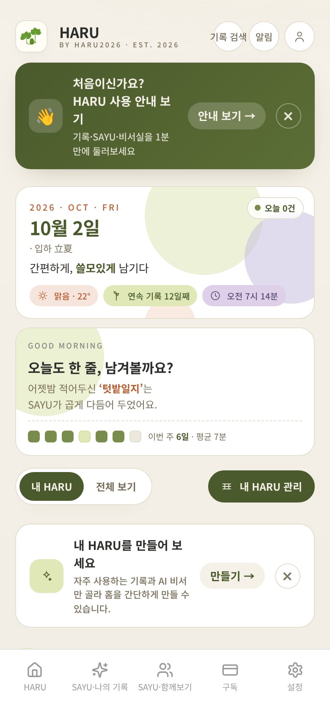
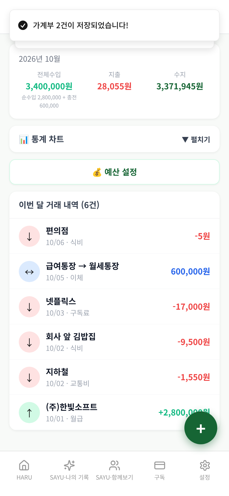
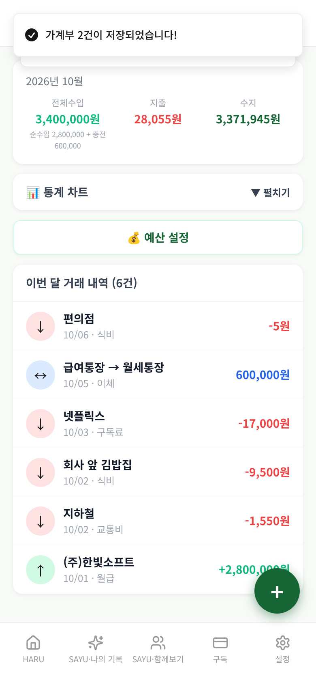
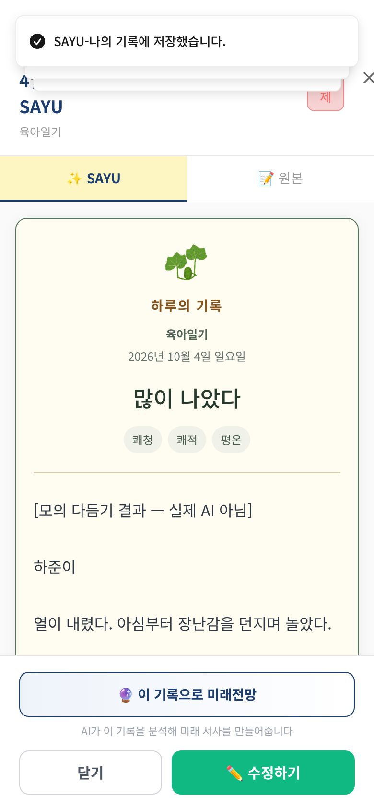
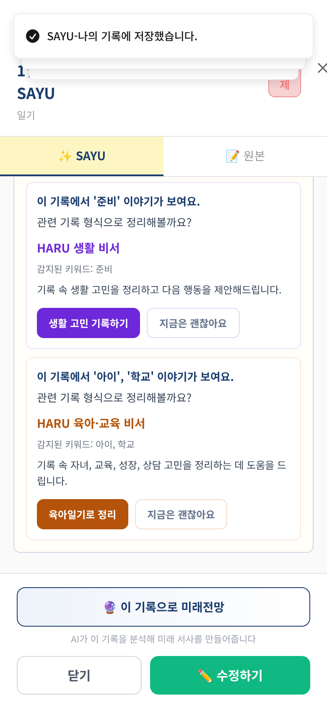
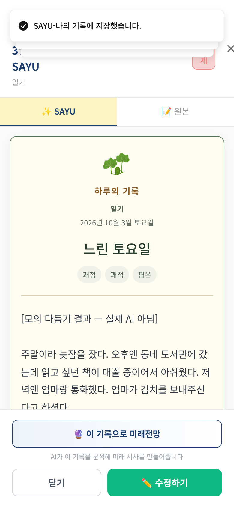
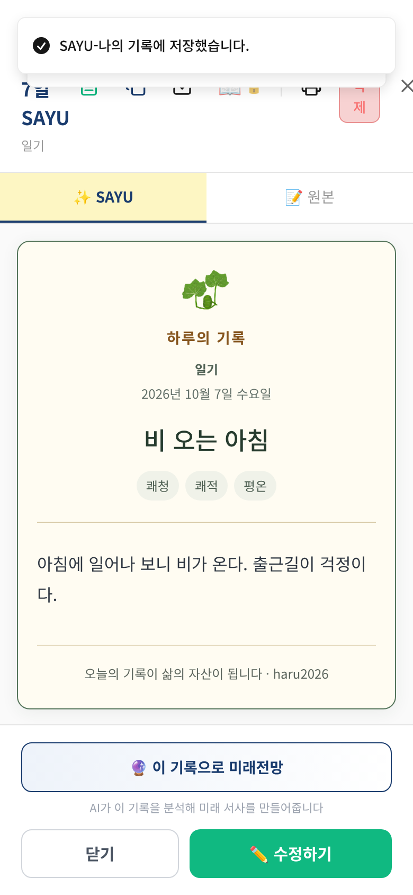
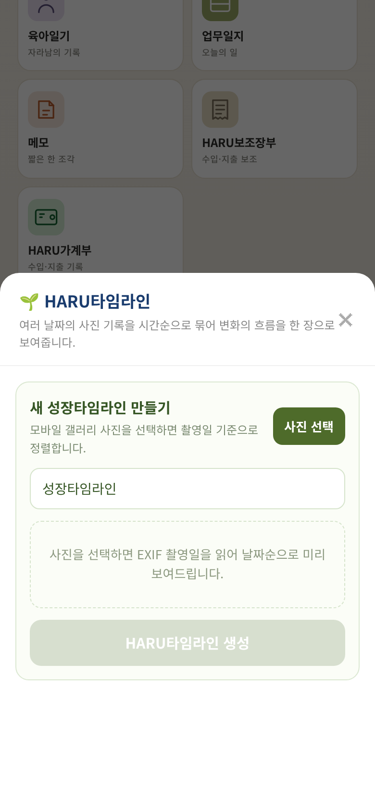

# 가상사용자 시뮬레이션 1차 파일럿 결과 보고 (2026-10-07)

- 실행 ID: `2026-10-07T10-40-32` · 대상: 가상인물 3명 · 방식: **A단계(격리 검증)** — 실제 앱 화면을 모바일 브라우저로 조작하고 Firebase·AI만 모의 (운영 DB·AI·서버 접속 0건)
- 점검 140개 중 130개 충족, 10개 미충족 · 발견 12건(치명 0 / 중대 4 / 경미 4 / 제안 4 / 참고 0) · 실행 시간 합계 96.4초

## 먼저 볼 것

실제 사용자가 마주치면 결과가 틀리게 보이거나 신뢰를 해칠 수 있는 항목입니다(근거 화면·코드 위치는 2절).

- **F-01** [중대] 홈 상단의 "연속 기록 12일째"·"어젯밤 적어두신 ‘텃밭일지’" 등이 실제 기록과 무관한 고정 문구다
- **F-02** [중대] 이체가 "충전"으로 전체수입·수지에 더해져, 안내 예시대로 내 통장끼리 옮기면 합계가 부풀려 보인다
- **F-03** [중대] 금액을 "5천원"처럼 한글 단위로 쓰면 5원으로 계산되어 합계에 조용히 반영된다
- **F-04** [중대] 날짜를 비워 두고 저장한 거래가 가계부 합계·목록에서 사라진다

## 1. 인물별 요약

| 인물 | 형식 | 나이·성별·직업 | 단계(실패) | 점검 충족/전체 | 발견 | 소요 |
|---|---|---|---|---|---|---|
| 김서연 | 일기 | 34세·여·초등학교 교사 | 34(0) | 79/81 | 4 | 44.6초 |
| 한지민 | 육아일기 | 36세·여·회사원(육아휴직 중) | 19(0) | 38/40 | 3 | 26.6초 |
| 송다은 | HARU가계부 | 26세·여·사회초년생(IT 회사 1년 차) | 8(0) | 13/19 | 5 | 25.2초 |

## 2. 발견 사항 종합

| ID | 심각도 | 제목 | 형식·인물 |
|---|---|---|---|
| F-01 | 중대 | 홈 상단의 "연속 기록 12일째"·"어젯밤 적어두신 ‘텃밭일지’" 등이 실제 기록과 무관한 고정 문구다 | 일기·김서연 |
| F-02 | 중대 | 이체가 "충전"으로 전체수입·수지에 더해져, 안내 예시대로 내 통장끼리 옮기면 합계가 부풀려 보인다 | HARU가계부·송다은 |
| F-03 | 중대 | 금액을 "5천원"처럼 한글 단위로 쓰면 5원으로 계산되어 합계에 조용히 반영된다 | HARU가계부·송다은 |
| F-04 | 중대 | 날짜를 비워 두고 저장한 거래가 가계부 합계·목록에서 사라진다 | HARU가계부·송다은 |
| F-05 | 경미 | "기존 대상 선택" 목록에 이름이 같은 아이가 구분 없이 두 번 나온다 | 육아일기·한지민 |
| F-06 | 경미 | 같은 이름을 "새 대상 추가"에 다시 입력하면 같은 아이가 중복 등록된다 | 육아일기·한지민 |
| F-07 | 경미 | "첫 기록 추가"로 저장하면 가계부 화면이 아니라 홈으로 돌아간다 ("+" 버튼과 동작이 다름) | HARU가계부·송다은 |
| F-08 | 경미 | 가계부에서 직접 입력한 제목이 저장되지 않고 자동 제목으로 바뀐다 | HARU가계부·송다은 |
| F-09 | 제안 | "아이들" 단어만으로 육아 비서를 추천한다(교사 기록 오탐) | 일기·김서연 |
| F-10 | 제안 | AI 다듬기 1회에 서버가 Gemini를 3번 부르는데, 저장 경로에서 통계·한마디 결과가 쓰이지 않는다 (비용 확인 권장) | 일기·김서연 |
| F-11 | 제안 | 날씨·체감기온·기분 기본값이 선택하지 않아도 저장된다 | 일기·김서연 |
| F-12 | 제안 | HARU타임라인은 갤러리에서 사진을 새로 고르는 화면이라, 육아일기로 쌓은 아이 기록과 이어지지 않는다 | 육아일기·한지민 |

> 심각도: **치명**(데이터 손실·저장 실패) / **중대**(결과가 틀리게 보이거나 흐름이 막힘) / **경미**(불편·일관성) / **제안**(개선 아이디어·비용 확인) / **참고**(맥락 정보)

### F-01 [중대] 홈 상단의 "연속 기록 12일째"·"어젯밤 적어두신 ‘텃밭일지’" 등이 실제 기록과 무관한 고정 문구다

- 발견 인물: 김서연(일기) · 단계: 2번째 기록(2026-10-02) 진입
- 내용: 1일 동안 일기만 기록한 사용자의 홈에도(처음 접속한 신규 사용자 포함) "연속 기록 12일째", "어젯밤 적어두신 ‘텃밭일지’는 SAYU가 곱게 다듬어 두었어요", "이번 주 6일·평균 7분", "맑음 22°", "오전 7시 14분 GOOD MORNING"(밤 9시에도)이 그대로 보인다. HomePageV2.tsx 1377~1493줄에 문자열이 직접 적혀 있다(실제 기록·시각·날씨를 읽지 않음).
- 증거 화면: 

### F-02 [중대] 이체가 "충전"으로 전체수입·수지에 더해져, 안내 예시대로 내 통장끼리 옮기면 합계가 부풀려 보인다

- 발견 인물: 송다은(HARU가계부) · 단계: 1일차 저장 결과·합계 확인
- 내용: 입력 안내 예시("급여통장 → 생활비통장")대로 내 통장끼리의 이체 600,000원을 기록하자, 월급 2,800,000원만 벌었는데 화면의 전체수입은 3,400,000원(순수입 2,800,000 + 충전 600,000), 수지는 3,371,950원으로 표시된다(내 통장끼리의 이동이라면 수지는 2,771,950원이어야 한다). HouseholdPage.tsx 에서 balance = income + transfer − expense 로 계산한다. 이체를 "충전(수입에 합산)"으로 보는 설계 의도일 수 있으나, 입력칸 안내("급여통장 → 생활비통장")는 내 통장 간 이동이라 서로 충돌한다 — 의도 확인이 필요하다.
- 증거 화면: 

### F-03 [중대] 금액을 "5천원"처럼 한글 단위로 쓰면 5원으로 계산되어 합계에 조용히 반영된다

- 발견 인물: 송다은(HARU가계부) · 단계: 2일차 저장 결과·합계 확인
- 내용: 금액 칸에 "5천원"을 입력해도 저장은 되지만 합계 계산(parseAmount)이 숫자만 뽑아 5원으로 처리한다. 입력 안내 예시는 "50000"이지만 사용자는 "5천원", "1만5천원"(→15원)처럼 쓰기 쉽다. 화면 지출 28,055원 / 기대 36,050원.
- 증거 화면: 

### F-04 [중대] 날짜를 비워 두고 저장한 거래가 가계부 합계·목록에서 사라진다

- 발견 인물: 송다은(HARU가계부) · 단계: 2일차 저장 결과·합계 확인
- 내용: 날짜 칸을 비운 채 저장한 거래("버스 3,000원")는 저장은 성공하지만 이번 달 거래 내역에 집계되지 않는다(화면 6건, 기대 7건). 날짜 입력은 필수 표시나 안내가 없고, 저장 시 오늘 날짜로 채워지지도 않는다(월 집계가 거래 날짜 문자열로 이뤄짐).
- 증거 화면: 

### F-05 [경미] "기존 대상 선택" 목록에 이름이 같은 아이가 구분 없이 두 번 나온다

- 발견 인물: 한지민(육아일기) · 단계: 4번째 기록(2026-10-04) 작성
- 내용: 3일차의 중복 등록 뒤 4일차에 목록을 열자 선택지가 ["기존 대상 선택","하준","하준"] 로 보인다. 생년월일 등 구분 정보가 없어 어느 쪽이 원래 아이인지 사용자가 알 수 없다.
- 증거 화면: 

### F-06 [경미] 같은 이름을 "새 대상 추가"에 다시 입력하면 같은 아이가 중복 등록된다

- 발견 인물: 한지민(육아일기) · 단계: 성장 대상(아이) 데이터 점검
- 내용: 3일차에 "하준"을 새 대상 칸에 다시 입력해 저장하자 이름이 같은 성장 대상이 2개 생겼다. 대상 A: 생년월일 2025-08-05, 연결된 기록일 2026-10-01·2026-10-02 / 대상 B: 생년월일 없음, 연결된 기록일 2026-10-03·2026-10-04. 4일차에는 "기존 대상 선택"에서 첫 번째 "하준"을 골랐지만 기록은 생년월일이 없는 쪽(대상 B)에 쌓였다. 아이의 4일치 기록이 2+2로 갈라져 이후 타임라인·성장 통계가 아이별로 나뉠 수 있다.
- 증거 화면: 

### F-07 [경미] "첫 기록 추가"로 저장하면 가계부 화면이 아니라 홈으로 돌아간다 ("+" 버튼과 동작이 다름)

- 발견 인물: 송다은(HARU가계부) · 단계: 1일차 저장
- 내용: 빈 가계부 화면의 "첫 기록 추가"로 거래를 저장하면 /v2 (홈)로 이동해 방금 입력한 합계를 바로 볼 수 없다. 오른쪽 아래 "+" 버튼은 저장 후 /household 로 돌아온다. HouseholdPage.tsx 363줄(첫 기록 추가)은 from 값을 넘기지 않고 387줄(+)은 from:'/household' 를 넘긴다.
- 증거 화면: 

### F-08 [경미] 가계부에서 직접 입력한 제목이 저장되지 않고 자동 제목으로 바뀐다

- 발견 인물: 송다은(HARU가계부) · 단계: 1일차 저장 결과·합계 확인
- 내용: 제목 칸에 "10월 생활비"를 입력해 저장했지만 저장된 제목은 "2026.10.01 · 수입 · (주)한빛소프트" (첫 거래의 날짜·유형·사용처로 자동 생성). 제목 입력칸이 화면에 있는데 쓰이지 않는다(FormatModal.tsx 2489·2509줄).
- 증거 화면: 

### F-09 [제안] "아이들" 단어만으로 육아 비서를 추천한다(교사 기록 오탐)

- 발견 인물: 김서연(일기) · 단계: 1번째 기록(2026-10-01) 저장 결과 확인
- 내용: 초등학교 교사가 학급 아이들 이야기를 쓴 일기인데 저장 직후 "HARU 육아·교육 비서 — 감지된 키워드: 아이 → 육아일기로 정리"가 추천됐다. 같은 화면에서 추천된 키워드는 ["준비"] 이며, 소풍 "준비"만으로도 생활 비서가 추천된다. 키워드 포함 여부만 보고 직업·맥락을 구분하지 않는다.
- 증거 화면: 

### F-10 [제안] AI 다듬기 1회에 서버가 Gemini를 3번 부르는데, 저장 경로에서 통계·한마디 결과가 쓰이지 않는다 (비용 확인 권장)

- 발견 인물: 김서연(일기) · 단계: 3번째 기록(2026-10-03) 저장 결과 확인
- 내용: 서버 polishContent(index.ts 2486~2552줄)는 한 번에 ①다듬기 ②통계 분석(analyzeStats) ③AI 한마디를 각각 Gemini로 호출한다. 그런데 일기 저장 결과에는 diary_polished(true)·diary_stats가 없다 — RecordPage 저장 함수(1085~1091줄)가 문자열 값만 통과시켜 boolean·객체가 버려진다. 한마디(aiComment)는 FormatModal 경로가 아예 읽지 않는다. 통계 화면은 저장된 stats가 아니라 기록을 다시 계산한다(firestoreService.calculateFormatStatistics). 결과가 쓰이는 곳이 따로 있는지 확인이 필요하며, 없다면 호출 3회 중 2회가 버려진다.
- 증거 화면: 

### F-11 [제안] 날씨·체감기온·기분 기본값이 선택하지 않아도 저장된다

- 발견 인물: 김서연(일기) · 단계: 7번째 기록(2026-10-07 07:30) 저장 결과 확인
- 내용: 본문에 "비가 온다"고 썼지만 날씨 칸을 건드리지 않아 weather="쾌청", temperature="쾌적", mood="평온" 로 저장됨. 목록 화면에도 그대로 표시됨.
- 증거 화면: 

### F-12 [제안] HARU타임라인은 갤러리에서 사진을 새로 고르는 화면이라, 육아일기로 쌓은 아이 기록과 이어지지 않는다

- 발견 인물: 한지민(육아일기) · 단계: 홈 HARU타임라인 화면 확인
- 내용: 육아일기에서 아이 "하준"을 등록하고 4일간 사진·기록을 남겼지만, 홈의 HARU타임라인을 열면 "새 성장타임라인 만들기(사진 선택)"만 나오고 하준의 기록·사진을 불러오는 선택지가 보이지 않는다.
- 증거 화면: 

## 3. 인물별 상세

### 김서연 — 일기

| 항목 | 내용 |
|---|---|
| 나이·성별 | 34세 · 여 |
| 직업 | 초등학교 교사 |
| 기기 | iPhone 모양(Chromium 모바일 에뮬레이션, 390×844) |
| IT 숙련도 | 중 |
| 요금제 | 무료(월 AI 도움 10회) |
| 사용 목적 | 퇴근 후 폰으로 하루를 짧게 남기고 싶다. 쓰다 보면 습관이 되길 바란다. |

**시나리오**

1. 1일차: 처음 설치한 사용자 — 첫 안내 화면에서 "바로 첫 기록 쓰기"를 누르고, 제목 없이 저장을 시도했다가 막힌 뒤 제목을 넣어 저장
2. 2일차: 이모지가 섞인 아주 짧은 간편 기록
3. 3일차: "AI 다듬은 글 저장" 사용(월 한도 차감 확인)
4. 4일차: 프리미엄(항목별 4칸) 기록
5. 5일차: 사진 1장을 붙인 기록
6. 6일차: 한 줄짜리 극단적으로 짧은 기록
7. 7일차: 같은 날 아침·저녁 2건 작성 → 내 기록(SAYU) 목록에서 8건 확인

**실행 단계**

| # | 단계 | 결과 | 소요 | 화면에 뜬 안내 |
|---|---|---|---|---|
| 1 | 1번째 기록(2026-10-01) 진입 | 완료 | 4.1초 |  |
| 2 | 1번째 기록(2026-10-01) 작성 | 완료 | 0.2초 | 제목을 입력해 주세요. 제목이 있어야 나중에 목록에서 내용을 확인하기 편합니다. |
| 3 | 1번째 기록(2026-10-01) 원본 저장 | 완료 | 1.3초 | SAYU-나의 기록에 저장했습니다. / 내용이 저장되었습니다! / 제목을 입력해 주세요. 제목이 있어야 나중에 목록에서 내용을 확인하기 편합니다. |
| 4 | 1번째 기록(2026-10-01) 저장 결과 확인 | 완료 | 0.5초 | SAYU-나의 기록에 저장했습니다. / 내용이 저장되었습니다! / 제목을 입력해 주세요. 제목이 있어야 나중에 목록에서 내용을 확인하기 편합니다. |
| 5 | 2번째 기록(2026-10-02) 진입 | 완료 | 3.2초 |  |
| 6 | 2번째 기록(2026-10-02) 작성 | 완료 | 0.0초 |  |
| 7 | 2번째 기록(2026-10-02) 원본 저장 | 완료 | 1.3초 | SAYU-나의 기록에 저장했습니다. / 내용이 저장되었습니다! |
| 8 | 2번째 기록(2026-10-02) 저장 결과 확인 | 완료 | 0.0초 | SAYU-나의 기록에 저장했습니다. / 내용이 저장되었습니다! |
| 9 | 3번째 기록(2026-10-03) 진입 | 완료 | 3.0초 |  |
| 10 | 3번째 기록(2026-10-03) 작성 | 완료 | 0.0초 |  |
| 11 | 3번째 기록(2026-10-03) AI 다듬어 저장 | 완료 | 1.8초 | SAYU-나의 기록에 저장했습니다. / 내용이 저장되었습니다! / AI 다듬기 완료! / 일기 AI 다듬기를 시작합니다... (PREMIUM 모드) |
| 12 | 3번째 기록(2026-10-03) 저장 결과 확인 | 완료 | 0.0초 | SAYU-나의 기록에 저장했습니다. / 내용이 저장되었습니다! / AI 다듬기 완료! / 일기 AI 다듬기를 시작합니다... (PREMIUM 모드) |
| 13 | 4번째 기록(2026-10-04) 진입 | 완료 | 3.0초 |  |
| 14 | 4번째 기록(2026-10-04) 작성 | 완료 | 0.1초 |  |
| 15 | 4번째 기록(2026-10-04) 원본 저장 | 완료 | 1.2초 | SAYU-나의 기록에 저장했습니다. / 내용이 저장되었습니다! |
| 16 | 4번째 기록(2026-10-04) 저장 결과 확인 | 완료 | 0.0초 | SAYU-나의 기록에 저장했습니다. / 내용이 저장되었습니다! |
| 17 | 5번째 기록(2026-10-05) 진입 | 완료 | 3.0초 |  |
| 18 | 5번째 기록(2026-10-05) 작성 | 완료 | 1.9초 | 1장의 사진이 업로드되었습니다! |
| 19 | 5번째 기록(2026-10-05) 원본 저장 | 완료 | 1.3초 | SAYU-나의 기록에 저장했습니다. / 내용이 저장되었습니다! / 1장의 사진이 업로드되었습니다! |
| 20 | 5번째 기록(2026-10-05) 저장 결과 확인 | 완료 | 0.0초 | SAYU-나의 기록에 저장했습니다. / 내용이 저장되었습니다! / 1장의 사진이 업로드되었습니다! |
| 21 | 6번째 기록(2026-10-06) 진입 | 완료 | 3.1초 |  |
| 22 | 6번째 기록(2026-10-06) 작성 | 완료 | 0.0초 |  |
| 23 | 6번째 기록(2026-10-06) 원본 저장 | 완료 | 1.3초 | SAYU-나의 기록에 저장했습니다. / 내용이 저장되었습니다! |
| 24 | 6번째 기록(2026-10-06) 저장 결과 확인 | 완료 | 0.0초 | SAYU-나의 기록에 저장했습니다. / 내용이 저장되었습니다! |
| 25 | 7번째 기록(2026-10-07 07:30) 진입 | 완료 | 3.0초 |  |
| 26 | 7번째 기록(2026-10-07 07:30) 작성 | 완료 | 0.0초 |  |
| 27 | 7번째 기록(2026-10-07 07:30) 원본 저장 | 완료 | 1.2초 | SAYU-나의 기록에 저장했습니다. / 내용이 저장되었습니다! |
| 28 | 7번째 기록(2026-10-07 07:30) 저장 결과 확인 | 완료 | 0.0초 | SAYU-나의 기록에 저장했습니다. / 내용이 저장되었습니다! |
| 29 | 8번째 기록(2026-10-07 21:40) 진입 | 완료 | 3.0초 |  |
| 30 | 8번째 기록(2026-10-07 21:40) 작성 | 완료 | 0.0초 |  |
| 31 | 8번째 기록(2026-10-07 21:40) 원본 저장 | 완료 | 1.3초 | SAYU-나의 기록에 저장했습니다. / 내용이 저장되었습니다! |
| 32 | 8번째 기록(2026-10-07 21:40) 저장 결과 확인 | 완료 | 0.0초 | SAYU-나의 기록에 저장했습니다. / 내용이 저장되었습니다! |
| 33 | 내 기록(SAYU) 월별 목록 점검 | 완료 | 1.3초 | SAYU-나의 기록에 저장했습니다. / 내용이 저장되었습니다! |
| 34 | 내 기록(SAYU) 달력 점검 | 완료 | 1.2초 | SAYU-나의 기록에 저장했습니다. / 내용이 저장되었습니다! |

**점검 결과** — 충족 79 / 전체 81

| 미충족 점검 | 근거 |
|---|---|
| 홈 상단 연속기록·최근기록 문구가 실제 기록과 일치한다 | 1일 기록한 사용자의 홈에 "연속 기록 12일째"/"어젯밤 적어두신 ‘텃밭일지’" 문구가 보임 |
| AI 다듬기 저장 시 다듬음 표시(polished)와 통계(stats)가 기록에 남는다 | polished=undefined, stats=undefined, 저장된 키=diary_title,diary_simple,diary_sayu,diary_images,diary_imageMeta,diary_polishedAt,diary_mode,diary_style |

**호출·저장 요약**

- 모의 서버 함수 호출: recordPaidServiceUsage 8회, getMonthlyAiQuotaStatus 1회, polishContent 1회
- 저장된 기록 문서: 8건 · 사진 업로드 1건
- 외부 요청 차단 0건 · 모의되지 않은 함수 없음 · 콘솔 오류 0건 · 페이지 오류 0건

### 한지민 — 육아일기

| 항목 | 내용 |
|---|---|
| 나이·성별 | 36세 · 여 |
| 직업 | 회사원(육아휴직 중) |
| 기기 | iPhone 모양(Chromium 모바일 에뮬레이션, 390×844) |
| IT 숙련도 | 중상 |
| 요금제 | 무료(월 AI 도움 10회) |
| 사용 목적 | 14개월 아들 "하준"의 하루를 항목별로 꼼꼼히 남기고, 사진과 함께 성장 기록으로 모아 두고 싶다. |

**시나리오**

1. 1일차: 처음 사용 — 프리미엄 5칸 작성, 성장 대상 "하준"(생년월일·성별) 새로 등록, 사진 2장
2. 2일차: 같은 아이를 "기존 대상 선택"으로 불러와 기록
3. 3일차: 이름을 다시 "새 대상 추가" 칸에 직접 입력하는 흔한 실수 — 중복 대상이 생기는지 확인
4. 4일차: AI 다듬기 사용
5. 마무리: 내 기록(SAYU) 목록과 홈의 HARU타임라인에서 아이 기록이 모이는지 확인

**실행 단계**

| # | 단계 | 결과 | 소요 | 화면에 뜬 안내 |
|---|---|---|---|---|
| 1 | 1번째 기록(2026-10-01) 진입 | 완료 | 4.0초 |  |
| 2 | 1번째 기록(2026-10-01) 작성 | 완료 | 2.0초 | 2장의 사진이 업로드되었습니다! |
| 3 | 1번째 기록(2026-10-01) 원본 저장 | 완료 | 1.3초 | SAYU-나의 기록에 저장했습니다. / 내용이 저장되었습니다! / 2장의 사진이 업로드되었습니다! |
| 4 | 1번째 기록(2026-10-01) 저장 결과 확인 | 완료 | 0.0초 | SAYU-나의 기록에 저장했습니다. / 내용이 저장되었습니다! / 2장의 사진이 업로드되었습니다! |
| 5 | 2번째 기록(2026-10-02) 진입 | 완료 | 3.0초 |  |
| 6 | 2번째 기록(2026-10-02) 작성 | 완료 | 0.1초 |  |
| 7 | 2번째 기록(2026-10-02) 원본 저장 | 완료 | 1.3초 | SAYU-나의 기록에 저장했습니다. / 내용이 저장되었습니다! |
| 8 | 2번째 기록(2026-10-02) 저장 결과 확인 | 완료 | 0.0초 | SAYU-나의 기록에 저장했습니다. / 내용이 저장되었습니다! |
| 9 | 3번째 기록(2026-10-03) 진입 | 완료 | 2.9초 |  |
| 10 | 3번째 기록(2026-10-03) 작성 | 완료 | 0.1초 |  |
| 11 | 3번째 기록(2026-10-03) 원본 저장 | 완료 | 1.3초 | SAYU-나의 기록에 저장했습니다. / 내용이 저장되었습니다! |
| 12 | 3번째 기록(2026-10-03) 저장 결과 확인 | 완료 | 0.0초 | SAYU-나의 기록에 저장했습니다. / 내용이 저장되었습니다! |
| 13 | 4번째 기록(2026-10-04) 진입 | 완료 | 3.0초 |  |
| 14 | 4번째 기록(2026-10-04) 작성 | 완료 | 0.1초 |  |
| 15 | 4번째 기록(2026-10-04) AI 다듬어 저장 | 완료 | 1.8초 | SAYU-나의 기록에 저장했습니다. / 내용이 저장되었습니다! / AI 다듬기 완료! / 육아일기 AI 다듬기를 시작합니다... (PREMIUM 모드) |
| 16 | 4번째 기록(2026-10-04) 저장 결과 확인 | 완료 | 0.0초 | SAYU-나의 기록에 저장했습니다. / 내용이 저장되었습니다! / AI 다듬기 완료! / 육아일기 AI 다듬기를 시작합니다... (PREMIUM 모드) |
| 17 | 성장 대상(아이) 데이터 점검 | 완료 | 0.0초 | SAYU-나의 기록에 저장했습니다. / 내용이 저장되었습니다! / AI 다듬기 완료! / 육아일기 AI 다듬기를 시작합니다... (PREMIUM 모드) |
| 18 | 내 기록(SAYU) 육아일기 묶음 점검 | 완료 | 1.3초 | SAYU-나의 기록에 저장했습니다. / 내용이 저장되었습니다! / AI 다듬기 완료! / 육아일기 AI 다듬기를 시작합니다... (PREMIUM 모드) |
| 19 | 홈 HARU타임라인 화면 확인 | 완료 | 2.8초 |  |

**점검 결과** — 충족 38 / 전체 40

| 미충족 점검 | 근거 |
|---|---|
| 아이의 기록 4일이 한 명의 성장 대상에 모두 쌓인다 | 대상별 연결일: [{"id":"UAy4JkzsMHDR2QBRNybR","birthdate":"2025-08-05","linked":["2026-10-01","2026-10-02"]},{"id":"dHW695OM4Dqh8XcgW2ma","birthdate":"없음","linked":["2026-10-03","2026-10-04"]}] |
| 같은 이름의 아이가 중복 등록되지 않는다 | "하준" 대상 2개 |

**호출·저장 요약**

- 모의 서버 함수 호출: recordPaidServiceUsage 4회, getMonthlyAiQuotaStatus 1회, polishContent 1회
- 저장된 기록 문서: 4건 · 사진 업로드 2건
- 외부 요청 차단 0건 · 모의되지 않은 함수 없음 · 콘솔 오류 0건 · 페이지 오류 0건

### 송다은 — HARU가계부

| 항목 | 내용 |
|---|---|
| 나이·성별 | 26세 · 여 |
| 직업 | 사회초년생(IT 회사 1년 차) |
| 기기 | iPhone 모양(Chromium 모바일 에뮬레이션, 390×844) |
| IT 숙련도 | 중상 |
| 요금제 | 무료(월 AI 도움 10회) |
| 사용 목적 | 월급·카드값·구독료를 한 곳에 적어 두고 이번 달에 얼마 썼는지 한눈에 보고 싶다. |

**시나리오**

1. 1일차: 홈의 HARU가계부 카드 → 가계부 화면 → "첫 기록 추가"로 월급·지출 3건·계좌이체 1건을 한 번에 입력해 저장하고, 위쪽 합계가 맞는지 확인
2. 2일차: 서두르다 하기 쉬운 입력 — 금액 비움, 사용처 비움, "5천원"처럼 한글 단위 금액, 날짜 비움

**실행 단계**

| # | 단계 | 결과 | 소요 | 화면에 뜬 안내 |
|---|---|---|---|---|
| 1 | 1일차 홈에서 HARU가계부 열기 | 완료 | 4.4초 |  |
| 2 | 1일차 "첫 기록 추가"로 거래 5건 입력 | 완료 | 3.3초 |  |
| 3 | 1일차 저장 | 완료 | 2.3초 | 가계부 5건이 저장되었습니다! / 내용이 저장되었습니다! |
| 4 | 1일차 저장 결과·합계 확인 | 완료 | 2.3초 |  |
| 5 | 2일차 가계부 열고 "+"로 새 기록 | 완료 | 4.1초 |  |
| 6 | 2일차 입력 실수 — 금액 비움 / 사용처 비움 | 완료 | 4.1초 | 사용처가 비어 있는 지출 거래(1건)를 확인해 주세요. / 금액이 비어 있는 거래(1건)를 확인해 주세요. |
| 7 | 2일차 거래 2건 저장 — "5천원" 금액, 날짜 비움 | 완료 | 3.1초 | 가계부 2건이 저장되었습니다! / 내용이 저장되었습니다! / 사용처가 비어 있는 지출 거래(1건)를 확인해 주세요. |
| 8 | 2일차 저장 결과·합계 확인 | 완료 | 0.8초 | 가계부 2건이 저장되었습니다! / 내용이 저장되었습니다! |

**점검 결과** — 충족 13 / 전체 19

| 미충족 점검 | 근거 |
|---|---|
| "첫 기록 추가"로 저장한 뒤 가계부 화면(/household)으로 돌아온다 | 저장 후 이동한 화면: /v2 |
| 입력한 제목("10월 생활비")이 그대로 저장된다 | household_title="2026.10.01 · 수입 · (주)한빛소프트" |
| 이번 달 수입 합계가 입력한 월급(2,800,000원)과 같다 | 화면 전체수입 3400000원 (순수입 2,800,000 + 충전 600,000) / 기대 2800000원 |
| 수지(수입−지출)가 2,771,950원이다 — 내 통장끼리 이체는 수지를 바꾸지 않아야 한다 | 화면 수지 3371950원 / 기대 2771950원 / 전체수입 3400000원 (순수입 2,800,000 + 충전 600,000) |
| 지출 합계에 "5천원"이 5,000원으로 반영된다 | 화면 지출 28055원 / 기대 36050원 (5천원→저장값 "5천원") |
| 날짜를 비운 거래(버스 3,000원)가 이번 달 합계에 포함된다 | 화면 거래 6건 / 기대 7건(1일차 5건 + 2일차 2건) |

**호출·저장 요약**

- 모의 서버 함수 호출: recordPaidServiceUsage 2회
- 저장된 기록 문서: 2건 · 사진 업로드 0건
- 외부 요청 차단 0건 · 모의되지 않은 함수 없음 · 콘솔 오류 0건 · 페이지 오류 0건

## 4. 격리·안전 확인

- 운영 Firebase·AI·결제 서버로 나간 요청: **0건** (하네스 서버 밖으로 향한 요청은 모두 차단·집계했고 차단 기록 자체가 없음)
- 저장은 브라우저 메모리(+localStorage)에만 남고 인물마다 별도 저장소를 쓴다. 운영 데이터를 읽거나 쓰지 않는다.
- AI 응답(다듬기·제목 등)은 모의값이라 **AI 결과의 품질은 이 보고서에서 평가하지 않았다.**

## 5. 이 시뮬레이션으로 알 수 없는 것

- AI 가 만든 글의 품질(원문 보존, 사실 추가, 마크다운 혼입 등) — 운영 서버 대상 C단계가 필요하다.
- 실제 아이폰 Safari 고유 문제 — Chromium 모바일 에뮬레이션(390×844)이며 글꼴도 Noto Sans KR 로 대체되어 줄바꿈 위치가 실기기와 다를 수 있다.
- 사람의 취향·구독 의사 — 가상인물은 실제 사용자보다 협조적이다. 실제 사용자 테스트를 병행해야 한다.
- 소셜 로그인·결제·푸시 알림·외부 조회(법제처·온비드 등) — 이 하네스의 범위가 아니다.

## 6. 시간·비용

| 인물 | 실행 시간 |
|---|---|
| 김서연(일기) | 44.6초 |
| 한지민(육아일기) | 26.6초 |
| 송다은(HARU가계부) | 25.2초 |
| 합계 | 96.4초 |

**실측**
- 3명 실행 합계 약 97초(일기 45초 · 육아일기 27초 · 가계부 25초). 한 번 만든 시나리오를 다시 돌릴 때는 스크립트만 실행되므로 **AI 토큰 0, 운영 비용 0**이다.
- 격리 하네스라 Gemini·Functions·Firestore 호출은 전부 모의이며 실제 요금이 발생하지 않는다.

**제작 비용(AI 작업 토큰, 대략치 — 디버깅 포함)**
- 하네스 최초 제작(가짜 Firebase, 모바일 브라우저 러너, 보고서 생성기): 약 15만 토큰, 1회성.
- 가상인물 3명 작성·보정·보고서: 약 19만 토큰(일기 인물은 하네스 보정이 섞여 비쌌다).
- 이후 인물 1명 추가당 약 2~5만 토큰(시나리오 작성 + 화면 확인 + 입력칸 보정)으로 본다. 나머지 19명이면 대략 40~100만 토큰이며, 비서 7개는 화면 구조가 달라 이 범위의 위쪽에 가까울 것으로 본다.


## 7. 다음 단계

1. 위 발견 사항 중 어떤 것을 수정할지 결정한다(이 보고서는 앱 코드를 바꾸지 않았다).
2. 형식·비서별 가상인물을 같은 방식으로 늘린다(2안 22명 중 나머지).
3. AI 결과 품질·외부 조회가 필요한 항목은 운영 서버 대상 C단계로 따로 진행한다(비용·운영 데이터 사용이라 대표 승인 필요).

## 8. 다시 실행하는 방법

```bash
cd frontend/test/persona-sim
npm install            # 최초 1회 (playwright-core, 글꼴)
node runner/run.mjs    # 모든 인물 실행 (예: node runner/run.mjs p01 p13)
node runner/report.mjs # 최근 실행 결과로 이 보고서 다시 만들기
```

> 실행 결과 원본(스크린샷·result.json)은 `out/runs/<실행ID>/` 에 남고 git 에는 올리지 않는다. 이 보고서에는 발견 증거 캡처만 `img/` 로 복사한다.
