# 가상사용자 2차 배치 결과 — 보조장부·텃밭일지·여행기록 (2026-10-08)

- 실행 ID: `2026-10-08T13-50-29` · 대상: 가상인물 3명 · 방식: **A단계(격리 검증)** — 실제 앱 화면을 모바일 브라우저로 조작하고 Firebase·AI만 모의 (운영 DB·AI·서버 접속 0건)
- 점검 133개 중 118개 충족, 15개 미충족 · 발견 13건(치명 0 / 중대 4 / 경미 3 / 제안 3 / 참고 3) · 실행 시간 합계 137.8초

## 작성 경위

- **기준**: 운영 `main` `ee0932f`(PR #266·#267 병합 직후)의 앱 코드를 임시 worktree 에 받고, 개발 브랜치(`claude/elegant-noether-z5zy29`)의 하네스를 그 위에 얹어 실행했습니다. 앱 소스·Firebase 설정·운영 DB·실제 AI 는 건드리지 않았고, 외부 요청 차단 장치에 걸린 요청은 0건입니다.
- **이번 3명**: 보조장부 오민석(카페 사장님·개인사업자) · 텃밭일지 윤정숙(주말농장) · 여행기록 장하늘(제주 3박 4일). 2안 22칸 중 6칸(일기·육아일기·가계부·보조장부·텃밭일지·여행기록)이 끝났고 16칸이 남았습니다(인물은 8명이지만 육아일기·가계부는 2명씩이라 칸 수는 6입니다).
- **수정·PR·병합·배포는 하지 않았습니다.** 발견 사항은 허대표님 결정 후 별도 작업으로 진행합니다.
- **같은 문제를 코드로 한 번 더 확인했습니다**: 날짜 형식(점 vs 하이픈) 문제는 하이픈 날짜로 입력한 거래 1건을 대조로 넣어 집계되는 것을 확인했고, 긴 글 AI 실패는 글자 수를 바꿔 가며(4,400자 성공 · 4,500자 실패) 경계를 확인했습니다.
- **판단을 보류한 관찰(발견 목록에 넣지 않음)**: 저장 직후 열린 SAYU 상세 창이 "닫기"로 닫히지 않는 현상이 하네스에서 한 번 나타났습니다. 코드상 원인은 `SayuPage` 의 "저장한 기록 열기" 효과(`setCurrentMonth(new Date(…))`)와 `[user, currentMonth]` 에 걸린 `fetchRecords` 효과가 서로를 다시 부르는 순환으로 추정되며(`fetchRecords` 가 1.5초에 200여 번 호출됨), 응답이 즉시 오는 모의 서버에서 4,800자짜리 기록이 목록에 있을 때만 이어졌습니다. 실제 서버(응답 지연)에서는 재현되지 않을 가능성이 높아 제품 결함으로 올리지 않았고, 오프라인(캐시 응답)에서 같은 일이 생기는지는 따로 확인이 필요합니다.


## 먼저 볼 것

실제 사용자가 마주치면 결과가 틀리게 보이거나 신뢰를 해칠 수 있는 항목입니다(근거 화면·코드 위치는 2절).

- **F-13** [중대] 월별 엑셀이 거래일이 아니라 "입력한 날"로 거른다 — 월초에 지난달 거래를 적으면 이번 달 엑셀에 섞인다
- **F-14** [중대] 보조장부 엑셀의 "계정과목집계" 시트가 매출(수입)과 지출을 한 합계로 더한다
- **F-15** [중대] 엑셀의 "부가세공제" 열이 입력한 공제 여부를 무시하고 거래처·분류로 짐작한 값을 쓴다
- **F-16** [중대] 부가세 신고 준비 집계가 "2026.09.28" 형식으로 입력한 거래를 한 건도 세지 못한다

## 1. 인물별 요약

| 인물 | 형식 | 나이·성별·직업 | 단계(실패) | 점검 충족/전체 | 발견 | 소요 |
|---|---|---|---|---|---|---|
| 오민석 | HARU보조장부 | 48세·남·동네 카페 사장님(개인사업자) | 19(0) | 24/32 | 6 | 51.9초 |
| 윤정숙 | 텃밭일지 | 63세·여·퇴직 후 주말농장 12평 경작 | 25(0) | 54/58 | 4 | 46.2초 |
| 장하늘 | 여행기록 | 29세·남·회사원(마케팅) | 23(0) | 40/43 | 4 | 39.8초 |

## 2. 발견 사항 종합

| ID | 심각도 | 제목 | 형식·인물 |
|---|---|---|---|
| F-13 | 중대 | 월별 엑셀이 거래일이 아니라 "입력한 날"로 거른다 — 월초에 지난달 거래를 적으면 이번 달 엑셀에 섞인다 | HARU보조장부 / 오민석 |
| F-14 | 중대 | 보조장부 엑셀의 "계정과목집계" 시트가 매출(수입)과 지출을 한 합계로 더한다 | HARU보조장부 / 오민석 |
| F-15 | 중대 | 엑셀의 "부가세공제" 열이 입력한 공제 여부를 무시하고 거래처·분류로 짐작한 값을 쓴다 | HARU보조장부 / 오민석 |
| F-16 | 중대 | 부가세 신고 준비 집계가 "2026.09.28" 형식으로 입력한 거래를 한 건도 세지 못한다 | HARU보조장부 / 오민석 |
| F-17 | 경미 | "내보낼 거래가 없습니다"라고 안내하면서도 거래 없는 빈 엑셀 파일을 내려받게 한다 | HARU보조장부 / 오민석 |
| F-18 | 경미 | 사진을 한 번에 최대 장수보다 많이 고르면 넘친 사진이 안내 없이 버려진다 | 텃밭일지·여행기록 / 윤정숙·장하늘 |
| F-19 | 경미 | 긴 글에서 AI 다듬기가 안 될 때 "AI 연결에 실패했습니다."라고만 나와 원인(글자 수 초과)을 알 수 없다 | 여행기록 / 장하늘 |
| F-20 | 제안 | 보조장부 "사업구분"이 HARU2026·외부용역 두 가지로 고정되어, 일반 개인사업자는 자기 사업을 나타낼 수 없다 | HARU보조장부 / 오민석 |
| F-21 | 제안 | 여행 기록에 "산책"이라고만 써도 반려동물 건강돌봄 비서가 추천된다 | 여행기록 / 장하늘 |
| F-22 | 제안 | 기록한 날이 항상 "오늘"로 고정되어, 여행 중 못 쓴 날을 나중에 그 날짜로 남길 수 없다 | 여행기록 / 장하늘 |
| F-23 | 참고 | 저장할 때 성공 안내가 두 번 뜬다 | 텃밭일지 / 윤정숙 |
| F-24 | 참고 | 작물 목록을 써 두면 본문 앞에 "작물: …" 줄이 따로 붙고, 저장 필드(garden_crop)는 직접 쓴 글 대신 목록으로 바뀐다 | 텃밭일지 / 윤정숙 |
| F-25 | 참고 | 텃밭일지도 같은 이름을 "새 대상 추가"에 다시 쓰면 같은 작물이 따로 등록된다(육아일기는 최근 수정으로 막힘) | 텃밭일지 / 윤정숙 |

> 심각도: **치명**(데이터 손실·저장 실패) / **중대**(결과가 틀리게 보이거나 흐름이 막힘) / **경미**(불편·일관성) / **제안**(개선 아이디어·비용 확인) / **참고**(맥락 정보)

### F-13 [중대] 월별 엑셀이 거래일이 아니라 "입력한 날"로 거른다 — 월초에 지난달 거래를 적으면 이번 달 엑셀에 섞인다

- 재현 인물: 오민석(HARU보조장부) · 대표 단계: 3일차 "이번달" 엑셀 저장
- 내용: 10/1에 9/28~9/30 거래 3건을 입력하고 10/6에 10월 거래 5건을 입력한 뒤 "이번달" 엑셀을 저장하니 8행이 들어갔고 그중 9월 거래가 3건이다(기대: 10월 거래 5건). 보조장부 엑셀(exportLedgerToXlsx)은 기록 문서의 저장일(r.date)로 기간을 거르고, 부가세·종합소득세 준비는 거래의 날짜(entry.date)로 거른다. 같은 달이라도 두 화면의 건수·합계가 서로 다르게 나온다.
- 증거 화면: 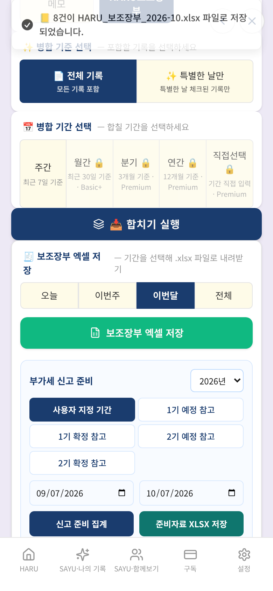

### F-14 [중대] 보조장부 엑셀의 "계정과목집계" 시트가 매출(수입)과 지출을 한 합계로 더한다

- 재현 인물: 오민석(HARU보조장부) · 대표 단계: 3일차 "전체" 엑셀 저장 — 계정과목 집계 확인
- 내용: 수입 3,740,000원, 지출 1,937,000원을 입력했는데 계정과목집계 시트의 합계가 5,677,000원(=수입+지출)이다. 매출이 "잡비" 같은 지출 계정으로 분류되어 지출과 같은 줄에 합산된다(ledgerExportService.ts exportLedgerToXlsx: accountSummary 에 거래 유형과 상관없이 더함). 세무사에게 넘길 자료로는 쓸 수 없다. 시트 내용: [["계정과목","합계(원)","비고"],["잡비",4785000,""],["접대비",880000,""],["복리후생비",12000,""],["합  계",5677000,""]]
- 증거 화면: 

### F-15 [중대] 엑셀의 "부가세공제" 열이 입력한 공제 여부를 무시하고 거래처·분류로 짐작한 값을 쓴다

- 재현 인물: 오민석(HARU보조장부) · 대표 단계: 3일차 "전체" 엑셀 저장 — 계정과목 집계 확인
- 내용: 접대비 거래를 "불공제"로 입력했는데 엑셀 상세 시트의 부가세공제 열은 "한도내공제"이다. 매출(수입) 거래에도 "공제가능"가 적힌다. inferVatDeductible()이 거래처 이름·계정과목만 보고 정하며 거래에 저장된 vatDeduction 은 읽지 않는다(ledgerExportService.ts). 같은 거래가 "부가세 신고 준비" 화면에서는 불공제로 집계되므로 두 자료가 서로 어긋난다.
- 증거 화면: 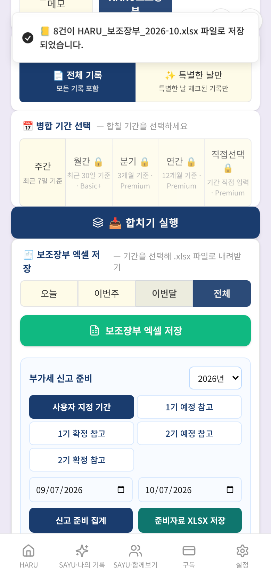

### F-16 [중대] 부가세 신고 준비 집계가 "2026.09.28" 형식으로 입력한 거래를 한 건도 세지 못한다

- 재현 인물: 오민석(HARU보조장부) · 대표 단계: 3일차 부가세 신고 준비 — 2기 예정(7~9월) 집계
- 내용: 보조장부 입력칸 안내 예시("예: 2026.05.18")대로 날짜를 쓰고 9월 거래 3건(매출 공급가액 2,100,000원 등)을 저장한 뒤 "2기 예정 참고" 기간으로 집계하니 {"sales":0,"outputVat":0,"purchase":0,"deductible":0,"nonDeductible":0,"expected":0}가 나왔고 안내는 ["선택 기간의 보조장부 거래가 없습니다."]였다(기대 {"sales":2100000,"outputVat":210000,"purchase":650000,"deductible":65000,"nonDeductible":0,"expected":145000}). 집계 함수(buildLedgerVatReport → isInRange)는 "YYYY-MM-DD" 형식의 날짜만 인정하는데, 직접 입력한 날짜는 입력한 글자 그대로("2026.09.28") 저장된다(정규화는 XLSX 가져오기에서만 한다). 종합소득세 준비도 같은 함수를 쓴다.
- 증거 화면: 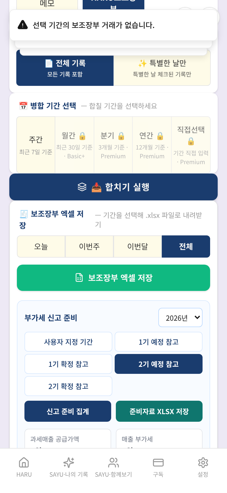

### F-17 [경미] "내보낼 거래가 없습니다"라고 안내하면서도 거래 없는 빈 엑셀 파일을 내려받게 한다

- 재현 인물: 오민석(HARU보조장부) · 대표 단계: 3일차 부가세 준비자료 XLSX 저장(10월)
- 내용: 부가세 준비자료 XLSX 저장을 누르자 "내보낼 사업용 매출·매입 거래가 없습니다."라는 안내가 뜨는데, 동시에 파일(download)이 내려받아졌다. 시트별 줄 수 {"VAT_Summary":12,"Sales":1,"Purchases":1,"Review_Required":1}로 매출·매입 시트는 제목 줄뿐이다(집계 시트만 0원으로 채워짐). 앞의 날짜 형식 문제로 거래가 0건이 된 경우뿐 아니라 거래 없는 기간을 고른 모든 경우에 해당한다(ledgerExportService.ts exportLedgerVatPrepToXlsx 가 건수와 상관없이 파일을 먼저 만든다). 세무사에게 빈 파일을 보내는 실수로 이어질 수 있다.
- 증거 화면: 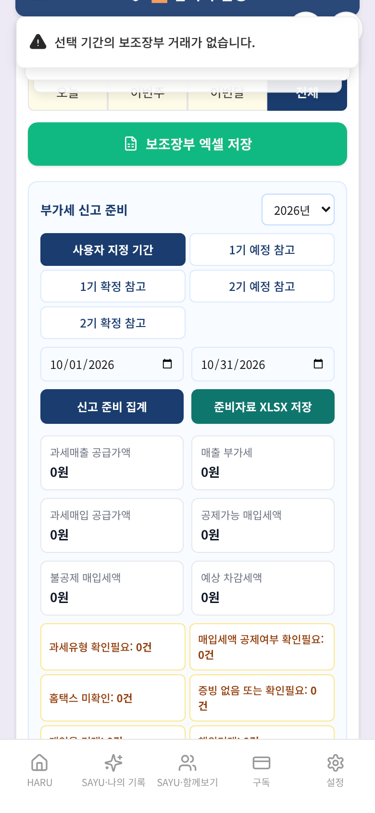

### F-18 [경미] 사진을 한 번에 최대 장수보다 많이 고르면 넘친 사진이 안내 없이 버려진다

- 재현 인물: 윤정숙(텃밭일지), 장하늘(여행기록) · 대표 단계: 4일차(2026-10-06) 작성
- 내용: 5장을 한꺼번에 고르자 앞의 3장만 올라가고 "3장의 사진이 업로드되었습니다!" 안내만 떴다. 나머지 2장이 빠졌다는 말은 없다. FormatModal.tsx handleImageUpload(1849~1859줄)는 남은 칸이 이미 0일 때만 "최대 N장까지만 업로드할 수 있습니다"를 보여 주고, 한 번에 더 많이 고른 경우에는 slice(0, 남은 칸)로 조용히 잘라 낸다. 사진을 여러 장 고르는 일이 흔한 여행기록·육아일기 등 모든 사진 형식에 해당한다.
- 증거 화면: 

### F-19 [경미] 긴 글에서 AI 다듬기가 안 될 때 "AI 연결에 실패했습니다."라고만 나와 원인(글자 수 초과)을 알 수 없다

- 재현 인물: 장하늘(여행기록) · 대표 단계: 4번째 기록(2026-10-03 21:10) AI 다듬기를 먼저 눌러 보기(긴 글)
- 내용: 여행기록 간편 기록에 4,800자를 쓰고 "AI 다듬은 후 저장"을 누르자 "AI 연결에 실패했습니다."라고만 나온다. 서버(functions/src/index.ts 2350줄)는 안내문을 합친 전체 길이가 5,000자를 넘으면 "텍스트는 5000자 이내여야 합니다."로 거절하는데, 클라이언트(FormatModal.tsx 1381줄)는 월 한도 오류만 따로 안내하고 나머지는 모두 "AI 연결에 실패했습니다."로 바꾼다. 화면에는 글자 수 표시도 없다. 안내문(약 500~600자)이 앞에 붙어 실제로는 본문 약 4,450자부터 실패했다(4,400자 성공, 4,500자 실패). 같은 글로 다시 눌러도 계속 실패하므로 사용자는 네트워크 문제로 오해하기 쉽다. 쓴 글은 사라지지 않고 원본 저장은 된다.
- 증거 화면: 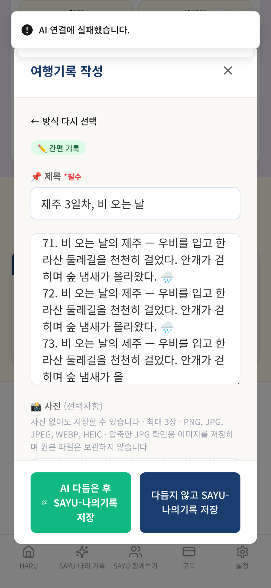

### F-20 [제안] 보조장부 "사업구분"이 HARU2026·외부용역 두 가지로 고정되어, 일반 개인사업자는 자기 사업을 나타낼 수 없다

- 재현 인물: 오민석(HARU보조장부) · 대표 단계: 1일차 홈에서 HARU보조장부 열기
- 내용: 화면 안내는 "개인 및 사업자의 수입·지출 기록을 돕기 위한 보조장부"인데, 필수 항목인 사업구분(*)의 선택지는 ["HARU2026","외부용역"] 두 가지뿐이다(저장 시 "사업구분을 선택해주세요. (HARU2026 / 외부용역)", FormatModal.tsx 2134·4483·5188줄). 카페 사장님은 어느 쪽도 자기 사업이 아니라 임의로 하나를 골라야 하고, 엑셀·집계에도 그 값이 그대로 쓰인다. 입력 예시 문구("앱 운영 구독료", "HARU2026 베타테스트 …")도 앱 운영자 기준이다. 일반 사용자에게 열어 둘 기능이라면 사업구분을 직접 입력/추가하게 하거나 비필수로 두는 방안을 검토할 수 있다(제품 방향은 대표님 결정).
- 증거 화면: 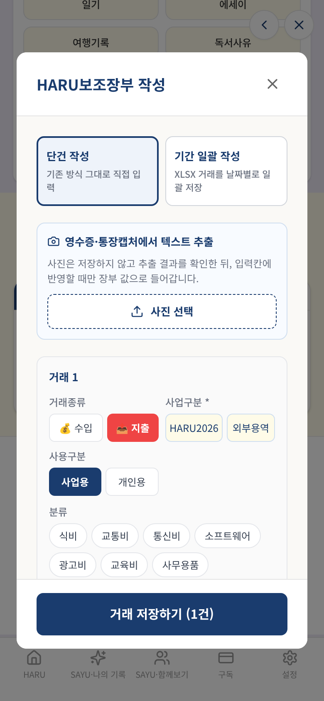

### F-21 [제안] 여행 기록에 "산책"이라고만 써도 반려동물 건강돌봄 비서가 추천된다

- 재현 인물: 장하늘(여행기록) · 대표 단계: 1번째 기록(2026-10-01 15:30) 원본 저장
- 내용: 반려동물 이야기가 없는 제주 여행 기록("협재해변 산책")을 저장하자 추천 목록이 ["HARU 여행 비서","HARU 반려동물건강돌봄비서"]로 나왔다. 반려동물 비서의 키워드에 "산책"이 들어 있어(utils/assistantRecommendations.ts 123줄) 사람의 산책에도 반응한다. 화면 문구: "반려동물건강돌봄비서 ⏎ 감지된 키워드: 산책 ⏎ 기록 속 반려동물의 먹거리 안전, 아픈 징조, 예방접종 내용을 확인하고 기록할 수 있습니다. ⏎ 반려동물 건강돌봄비서와 연결". 앞서 교사의 학급 일기에 육아일기를 추천한 것(F-10)과 같은 종류의 키워드 규칙 문제다.
- 증거 화면: 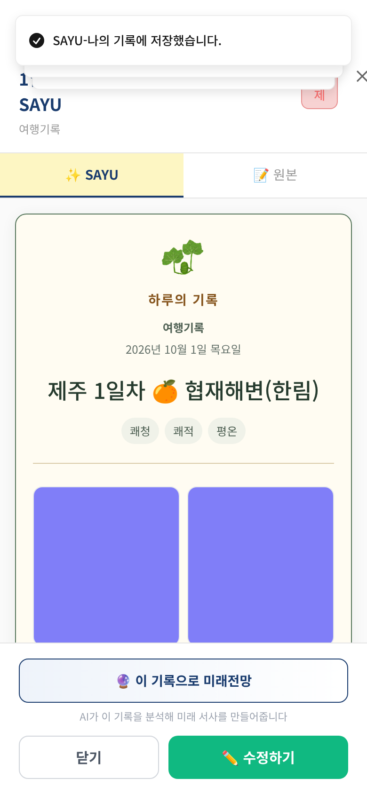

### F-22 [제안] 기록한 날이 항상 "오늘"로 고정되어, 여행 중 못 쓴 날을 나중에 그 날짜로 남길 수 없다

- 재현 인물: 장하늘(여행기록) · 대표 단계: 5번째 기록(2026-10-04 09:00) 작성
- 내용: 귀국한 다음 날(10/4) 아침에 "제주 3일차 저녁"을 쓰려 했지만 기록 화면에는 날짜를 바꾸는 칸이 없고(화면 표시 "2026.10.04 일요일", 날짜 입력칸 0개) 저장하면 10/4 기록이 된다. RecordPage.tsx 195줄 currentDate 가 읽기 전용 상태(useState(new Date()))다. 그 결과 SAYU 목록·달력의 여행 기록이 실제 여행일이 아니라 "쓴 날"에 쌓이고, 월별 합본에서도 여행 순서가 어긋날 수 있다. "하루 단위 기록" 철학에 따른 설계일 수 있어 결함이 아니라 제품 결정 사항으로 보고한다(가계부·보조장부는 거래마다 날짜 칸이 있음).
- 증거 화면: 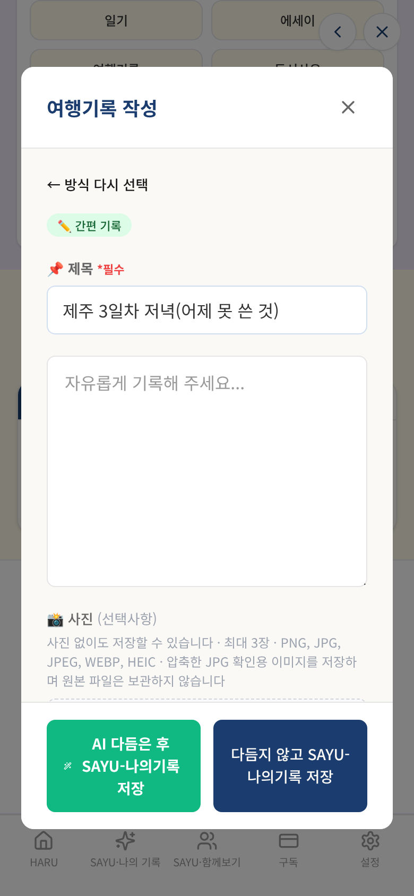

### F-23 [참고] 저장할 때 성공 안내가 두 번 뜬다

- 재현 인물: 윤정숙(텃밭일지) · 대표 단계: 1일차(2026-10-03) 저장 결과 확인
- 내용: 저장 직후 "SAYU-나의 기록에 저장했습니다." · "내용이 저장되었습니다!"가 함께 보인다(FormatModal 의 저장 안내와 RecordPage 의 저장 안내가 둘 다 뜸). 보조장부("보조장부 N건이 저장되었습니다!" + "내용이 저장되었습니다!")와 여행기록에서도 같았다. 기능 문제는 아니고 문구 정리 수준이다.
- 증거 화면: 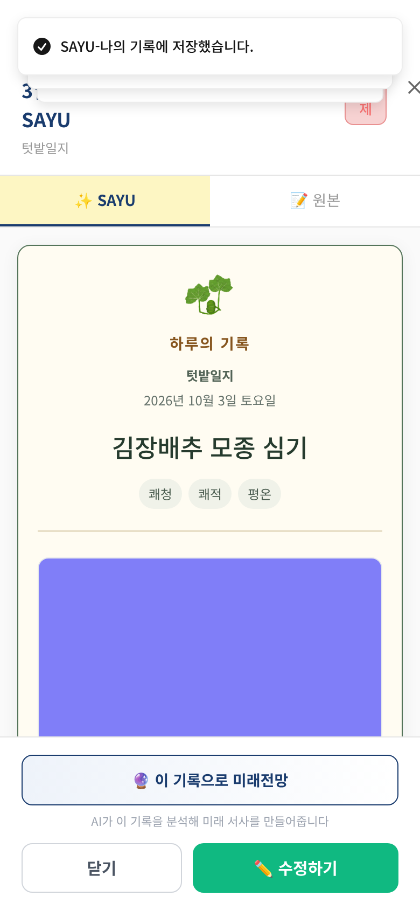

### F-24 [참고] 작물 목록을 써 두면 본문 앞에 "작물: …" 줄이 따로 붙고, 저장 필드(garden_crop)는 직접 쓴 글 대신 목록으로 바뀐다

- 재현 인물: 윤정숙(텃밭일지) · 대표 단계: 2일차(2026-10-04) 저장 결과 확인
- 내용: 작물 목록에 ["배추","무","갓"]를 넣고 프리미엄 "작물" 칸에 "배추 20포기, 무 한 이랑"라고 썼는데 저장된 garden_crop 은 "배추, 무, 갓"이다(직접 쓴 글은 garden_sayu 본문에만 남음). 본문(garden_sayu)에는 "작물: 배추, 무, 갓" 줄이 맨 앞에 붙고 바로 이어 직접 쓴 작물 글이 다시 나와 작물 정보가 두 번 적힌다(FormatModal.tsx 2755·2784줄).
- 증거 화면: 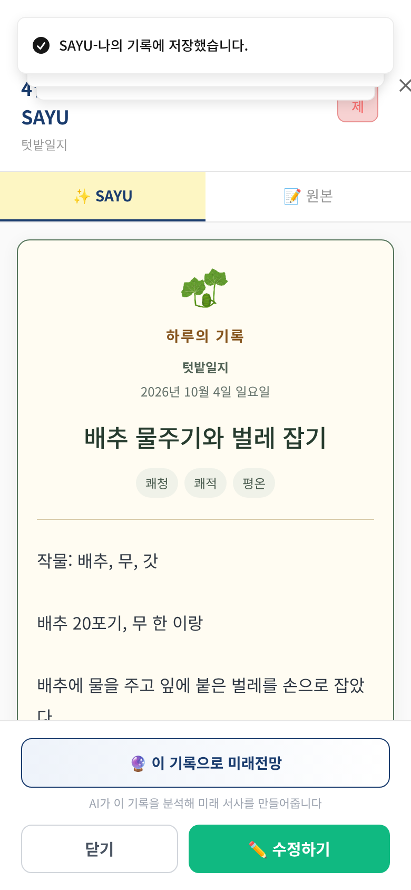

### F-25 [참고] 텃밭일지도 같은 이름을 "새 대상 추가"에 다시 쓰면 같은 작물이 따로 등록된다(육아일기는 최근 수정으로 막힘)

- 재현 인물: 윤정숙(텃밭일지) · 대표 단계: 성장 대상(작물) 데이터 점검
- 내용: 3일차에 목록에서 고르지 않고 "배추"를 새 대상 칸에 다시 입력하자 이름이 같은 작물 대상이 2개가 됐다. 대상 A 연결일: ["2026-10-03","2026-10-04"] / 대상 B 연결일: ["2026-10-05","2026-10-06","2026-10-07"]. 육아일기·건강성장 페이지의 같은 이름 아이 중복은 PR #266·#267 로 막았지만 텃밭일지는 범위에 넣지 않았다(작물은 이름이 겹쳐도 다른 밭·다른 시기일 수 있어 "같은 이름 = 같은 작물"로 볼지는 제품 결정 사항). 이 화면에서 만든 작물의 성장과정을 보여 주는 화면은 따로 없다(저장만 됨).
- 증거 화면: 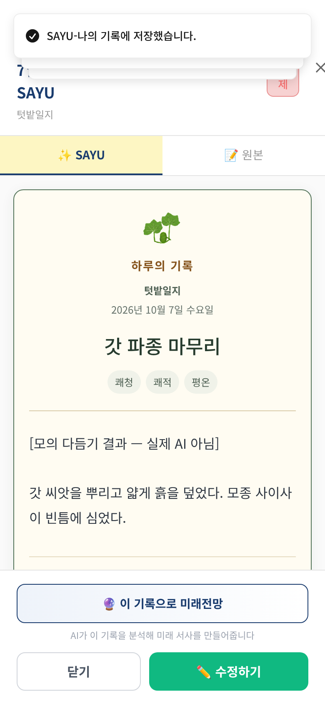

## 3. 인물별 상세

### 오민석 — HARU보조장부

| 항목 | 내용 |
|---|---|
| 나이·성별 | 48세 · 남 |
| 직업 | 동네 카페 사장님(개인사업자) |
| 기기 | iPhone 모양(Chromium 모바일 에뮬레이션, 390×844) |
| IT 숙련도 | 중하 |
| 요금제 | 무료(월 AI 도움 10회) |
| 사용 목적 | 가게 매출·재료비·접대비를 폰으로 그날그날 적어 두고, 부가세·종합소득세 신고 때 세무사에게 엑셀로 넘기고 싶다. |

**시나리오**

1. 1일차(10/1 월초 정리): 지난달 말(9/28~9/30) 거래 3건을 입력 — 카드 매출, 원두 매입(세금계산서), 전기요금
2. 2일차(10/6): 이번 달 거래 5건 입력 — 카드·현금 매출, 원두 매입, 거래처 접대(88만원, 매입세액 불공제), 개인 점심(개인용·증빙 없음). 사업구분을 빠뜨리는 실수 포함
3. 3일차(10/7): 기록합본 화면에서 보조장부 엑셀 저장(이번달/전체), 부가세 신고 준비(2기 예정·10월), 종합소득세 준비를 확인

**실행 단계**

| # | 단계 | 결과 | 소요 | 화면에 뜬 안내 |
|---|---|---|---|---|
| 1 | 1일차 홈에서 HARU보조장부 열기 | 완료 | 10.1초 |  |
| 2 | 1일차 지난달 말 거래 3건 입력 | 완료 | 1.7초 |  |
| 3 | 1일차 저장 | 완료 | 2.6초 | 보조장부 3건이 저장되었습니다! / 내용이 저장되었습니다! |
| 4 | 1일차 저장 결과 확인 | 완료 | 0.0초 | 보조장부 3건이 저장되었습니다! / 내용이 저장되었습니다! |
| 5 | 2일차 보조장부 열고 첫 거래 입력(사업구분을 빠뜨림) | 완료 | 3.6초 |  |
| 6 | 2일차 사업구분 없이 저장 시도 → 안내 후 선택 | 완료 | 0.7초 | 사업구분을 선택해주세요. (HARU2026 / 외부용역) |
| 7 | 2일차 나머지 거래 4건 입력 | 완료 | 2.8초 | 사업구분을 선택해주세요. (HARU2026 / 외부용역) |
| 8 | 2일차 저장 | 완료 | 5.4초 | 보조장부 5건이 저장되었습니다! / 내용이 저장되었습니다! |
| 9 | 2일차 저장 결과 확인 | 완료 | 0.0초 | 보조장부 5건이 저장되었습니다! / 내용이 저장되었습니다! |
| 10 | 3일차 기록합본에서 보조장부 열기 | 완료 | 3.8초 |  |
| 11 | 3일차 "이번달" 엑셀 저장 | 완료 | 0.3초 | 📒 8건이 HARU_보조장부_2026-10.xlsx 파일로 저장되었습니다. |
| 12 | 3일차 "전체" 엑셀 저장 — 계정과목 집계 확인 | 완료 | 0.2초 | 📒 8건이 HARU_보조장부_전체.xlsx 파일로 저장되었습니다. / 📒 8건이 HARU_보조장부_2026-10.xlsx 파일로 저장되었습니다. |
| 13 | 3일차 부가세 신고 준비 — 2기 예정(7~9월) 집계 | 완료 | 1.1초 | 선택 기간의 보조장부 거래가 없습니다. / 📒 8건이 HARU_보조장부_전체.xlsx 파일로 저장되었습니다. / 📒 8건이 HARU_보조장부_2026-10.xlsx 파일로 저장되었습니다. |
| 14 | 3일차 부가세 신고 준비 — 10월 직접 지정 집계 | 완료 | 1.1초 | 선택 기간의 보조장부 거래가 없습니다. / 선택 기간의 보조장부 거래가 없습니다. / 📒 8건이 HARU_보조장부_전체.xlsx 파일로 저장되었습니다. / 📒 8건이 HARU_보조장부_2026- |
| 15 | 3일차 종합소득세 준비 — 10월 집계 | 완료 | 1.1초 | 선택 기간의 보조장부 거래가 없습니다. / 선택 기간의 보조장부 거래가 없습니다. / 선택 기간의 보조장부 거래가 없습니다. / 📒 8건이 HARU_보조장부_전체.xlsx 파일로 저장되었습니다.  |
| 16 | 3일차 부가세 준비자료 XLSX 저장(10월) | 완료 | 0.1초 | 내보낼 사업용 매출·매입 거래가 없습니다. / 선택 기간의 보조장부 거래가 없습니다. / 선택 기간의 보조장부 거래가 없습니다. / 선택 기간의 보조장부 거래가 없습니다. / 📒 8건이 HARU_ |
| 17 | [대조] 하이픈 날짜(2026-10-07)로 적은 거래 1건 입력·저장 | 완료 | 6.2초 | 보조장부 1건이 저장되었습니다! / 내용이 저장되었습니다! |
| 18 | [대조] 10월 부가세 집계에 하이픈 날짜 거래만 잡히는지 | 완료 | 4.9초 | 부가세 신고 준비 집계 1건을 계산했습니다. |
| 19 | 3일차 내 기록(SAYU)에서 보조장부 기록 확인 | 완료 | 4.6초 |  |

**점검 결과** — 충족 24 / 전체 32

| 미충족 점검 | 근거 |
|---|---|
| 사업구분 선택지가 두 가지(HARU2026·외부용역)뿐이 아니다 | 선택지: ["HARU2026","외부용역"] |
| 이번달(10월) 엑셀에는 10월 거래 5건만 들어간다 | 엑셀 8행 (10월 거래 5건, 9월 거래 3건) — 파일 download |
| 계정과목 집계 시트의 합계가 수입과 지출을 한데 더하지 않는다 | 집계 시트 합계 5677000원 (수입 3740000 + 지출 1937000 = 5677000) / 시트 내용: [["계정과목","합계(원)","비고"],["잡비",4785000,""],["접대비",880000,""],["복리후생비",12000,""],["합  계",5677000,""]] |
| 상세 시트의 부가세공제 열이 입력한 "불공제"를 따른다 | 접대 거래(불공제로 입력)의 엑셀 값: "한도내공제" / 매출 거래의 엑셀 값: "공제가능" |
| 2기 예정(7~9월) 부가세 집계가 입력한 9월 거래 3건과 맞는다 | 화면 {"sales":0,"outputVat":0,"purchase":0,"deductible":0,"nonDeductible":0,"expected":0} / 기대 {"sales":2100000,"outputVat":210000,"purchase":650000,"deductible":65000,"nonDeductible":0,"expected":145000} / 안내 ["선택 기간의 보조장부 거래가 없습니다."] |
| 10월 부가세 집계가 입력한 10월 거래와 맞는다 | 화면 {"sales":0,"outputVat":0,"purchase":0,"deductible":0,"nonDeductible":0,"expected":0} / 기대 {"sales":1300000,"outputVat":130000,"purchase":1100000,"deductible":30000,"nonDeductible":80000,"expected":100000} / 안내 ["선택 기간의 보조장부 거래가 없습니다.","선택 기간의 보조장부 거래가 없습니다. |
| 종합소득세 준비의 총 수입이 10월 사업 매출 합계(1,430,000원)와 같다 | 화면 {"income":0,"deductible":0,"review":0} / 안내 ["선택 기간의 보조장부 거래가 없습니다.","선택 기간의 보조장부 거래가 없습니다.","선택 기간의 보조장부 거래가 없습니다."] |
| "내보낼 거래가 없다"고 안내하면 파일은 내려받아지지 않는다 | 안내 ["내보낼 사업용 매출·매입 거래가 없습니다."] / 내려받은 파일 download의 시트별 줄 수 {"VAT_Summary":12,"Sales":1,"Purchases":1,"Review_Required":1} |

**호출·저장 요약**

- 모의 서버 함수 호출: recordPaidServiceUsage 3회
- 저장된 기록 문서: 3건 · 사진 업로드 0건
- 외부 요청 차단 0건 · 모의되지 않은 함수 없음 · 콘솔 오류 0건 · 페이지 오류 0건

### 윤정숙 — 텃밭일지

| 항목 | 내용 |
|---|---|
| 나이·성별 | 63세 · 여 |
| 직업 | 퇴직 후 주말농장 12평 경작 |
| 기기 | iPhone 모양(Chromium 모바일 에뮬레이션, 390×844) |
| IT 숙련도 | 하 |
| 요금제 | 무료(월 AI 도움 10회) |
| 사용 목적 | 주말마다 배추·무·갓 키우는 과정을 사진과 함께 적어 두고, 작물별로 어떻게 자랐는지 나중에 보고 싶다. |

**시나리오**

1. 1일차(토): 처음 사용 — 간편 기록, 성장대상 "배추" 새로 추가, 사진 1장
2. 2일차(일): 작물 목록에 배추·무·갓을 넣고 프리미엄 6칸 기록, 성장대상은 "기존 대상 선택"에서 배추
3. 3일차(월): 목록에서 고르는 걸 잊고 "새 대상 추가"에 "배추"를 다시 입력하는 흔한 실수
4. 4일차(화): 사진 5장을 한꺼번에 고르기(최대 3장), 성장대상 목록에서 배추 고르기
5. 5일차(수): AI 다듬기 1회
6. 마무리: 내 기록(SAYU) 목록에서 5건 확인, 1일차 기록을 다시 열어 작물 정보 확인

**실행 단계**

| # | 단계 | 결과 | 소요 | 화면에 뜬 안내 |
|---|---|---|---|---|
| 1 | 1일차(2026-10-03) 진입 | 완료 | 4.1초 |  |
| 2 | 1일차(2026-10-03) 작성 | 완료 | 2.0초 | 1장의 사진이 업로드되었습니다! |
| 3 | 1일차(2026-10-03) 원본 저장 | 완료 | 1.4초 | SAYU-나의 기록에 저장했습니다. / 내용이 저장되었습니다! / 1장의 사진이 업로드되었습니다! |
| 4 | 1일차(2026-10-03) 저장 결과 확인 | 완료 | 0.0초 | SAYU-나의 기록에 저장했습니다. / 내용이 저장되었습니다! / 1장의 사진이 업로드되었습니다! |
| 5 | 2일차(2026-10-04) 진입 | 완료 | 3.1초 |  |
| 6 | 2일차(2026-10-04) 작물 목록에 작물 3개 추가 | 완료 | 1.7초 | 갓 추가! / 무 추가! / 배추 추가! |
| 7 | 2일차(2026-10-04) 작성 | 완료 | 0.1초 | 갓 추가! / 무 추가! / 배추 추가! |
| 8 | 2일차(2026-10-04) 원본 저장 | 완료 | 1.4초 | SAYU-나의 기록에 저장했습니다. / 내용이 저장되었습니다! / 갓 추가! / 무 추가! / 배추 추가! |
| 9 | 2일차(2026-10-04) 저장 결과 확인 | 완료 | 0.0초 | SAYU-나의 기록에 저장했습니다. / 내용이 저장되었습니다! / 갓 추가! / 무 추가! / 배추 추가! |
| 10 | 3일차(2026-10-05) 진입 | 완료 | 3.2초 |  |
| 11 | 3일차(2026-10-05) 작성 | 완료 | 0.0초 |  |
| 12 | 3일차(2026-10-05) 원본 저장 | 완료 | 1.3초 | SAYU-나의 기록에 저장했습니다. / 내용이 저장되었습니다! |
| 13 | 3일차(2026-10-05) 저장 결과 확인 | 완료 | 0.0초 | SAYU-나의 기록에 저장했습니다. / 내용이 저장되었습니다! |
| 14 | 4일차(2026-10-06) 진입 | 완료 | 3.1초 |  |
| 15 | 4일차(2026-10-06) 작성 | 완료 | 2.1초 | 3장의 사진이 업로드되었습니다! |
| 16 | 4일차(2026-10-06) 원본 저장 | 완료 | 1.3초 | SAYU-나의 기록에 저장했습니다. / 내용이 저장되었습니다! / 3장의 사진이 업로드되었습니다! |
| 17 | 4일차(2026-10-06) 저장 결과 확인 | 완료 | 0.0초 | SAYU-나의 기록에 저장했습니다. / 내용이 저장되었습니다! / 3장의 사진이 업로드되었습니다! |
| 18 | 5일차(2026-10-07) 진입 | 완료 | 3.0초 |  |
| 19 | 5일차(2026-10-07) 작성 | 완료 | 0.1초 |  |
| 20 | 5일차(2026-10-07) AI 다듬어 저장 | 완료 | 1.9초 | SAYU-나의 기록에 저장했습니다. / 내용이 저장되었습니다! / AI 다듬기 완료! / 텃밭일지 AI 다듬기를 시작합니다... (PREMIUM 모드) |
| 21 | 5일차(2026-10-07) 저장 결과 확인 | 완료 | 0.0초 | SAYU-나의 기록에 저장했습니다. / 내용이 저장되었습니다! / AI 다듬기 완료! / 텃밭일지 AI 다듬기를 시작합니다... (PREMIUM 모드) |
| 22 | 성장 대상(작물) 데이터 점검 | 완료 | 0.0초 | SAYU-나의 기록에 저장했습니다. / 내용이 저장되었습니다! / AI 다듬기 완료! / 텃밭일지 AI 다듬기를 시작합니다... (PREMIUM 모드) |
| 23 | 내 기록(SAYU) 텃밭일지 묶음 점검 | 완료 | 4.5초 |  |
| 24 | 1일차 기록을 다시 열어 작물 정보 확인 | 완료 | 2.4초 |  |
| 25 | 2일차 기록의 수정 화면에서 작물 칸 확인 | 완료 | 6.8초 |  |

**점검 결과** — 충족 54 / 전체 58

| 미충족 점검 | 근거 |
|---|---|
| 저장 성공 안내가 한 번만 뜬다 | 저장 직후 화면의 안내: ["SAYU-나의 기록에 저장했습니다.","내용이 저장되었습니다!"] |
| "작물" 칸에 직접 쓴 내용이 그대로 저장된다 | garden_crop="배추, 무, 갓" (직접 쓴 값 "배추 20포기, 무 한 이랑", 작물 목록 "배추, 무, 갓") |
| 사진을 3장 넘게 고르면 넘친 사진이 빠진다는 안내가 나온다 | 안내: ["3장의 사진이 업로드되었습니다!"] / 칸 표시: 사진 추가 (3/3) / 고른 사진 5장 |
| 같은 이름("배추")의 작물이 중복 등록되지 않는다 | "배추" 대상 2개: [{"id":"xKGxCkzGVwOwAg6GzniZ","linked":["2026-10-03","2026-10-04"]},{"id":"VZVDxcZTQsIYGYKUB2JO","linked":["2026-10-05","2026-10-06","2026-10-07"]}] |

**호출·저장 요약**

- 모의 서버 함수 호출: recordPaidServiceUsage 5회, getMonthlyAiQuotaStatus 1회, polishContent 1회
- 저장된 기록 문서: 5건 · 사진 업로드 4건
- 외부 요청 차단 0건 · 모의되지 않은 함수 없음 · 콘솔 오류 0건 · 페이지 오류 0건

### 장하늘 — 여행기록

| 항목 | 내용 |
|---|---|
| 나이·성별 | 29세 · 남 |
| 직업 | 회사원(마케팅) |
| 기기 | iPhone 모양(Chromium 모바일 에뮬레이션, 390×844) |
| IT 숙련도 | 상 |
| 요금제 | 무료(월 AI 도움 10회) |
| 사용 목적 | 제주 3박 4일 동안 장소마다 사진과 짧은 글을 남기고, 돌아와서 여행 한 편으로 읽고 싶다. |

**시나리오**

1. 1일차(10/1 낮): 프리미엄 6칸 기록 + 사진 3장 (이모지·괄호가 들어간 제목)
2. 1일차(밤): 같은 날 두 번째 기록 — 간편, 숙소에서 짧게
3. 2일차(10/2): 사진 4장을 한꺼번에 고르기, AI 다듬기 1회
4. 3일차(10/3): 비 오는 날 긴 글(약 4,800자)·줄바꿈·이모지 — AI 다듬기를 먼저 눌러 보고 안 되면 원본으로 저장
5. 4일차(10/4, 귀국 후): 어제(3일차) 못 쓴 저녁 일정을 "어제 날짜"로 남기려 해 본다
6. 마무리: 내 기록(SAYU) 목록·달력에서 여행기록 모음 확인

**실행 단계**

| # | 단계 | 결과 | 소요 | 화면에 뜬 안내 |
|---|---|---|---|---|
| 1 | 1번째 기록(2026-10-01 15:30) 진입 | 완료 | 4.1초 |  |
| 2 | 1번째 기록(2026-10-01 15:30) 작성 | 완료 | 2.1초 | 3장의 사진이 업로드되었습니다! |
| 3 | 1번째 기록(2026-10-01 15:30) 원본 저장 | 완료 | 1.5초 | SAYU-나의 기록에 저장했습니다. / 내용이 저장되었습니다! / 3장의 사진이 업로드되었습니다! |
| 4 | 1번째 기록(2026-10-01 15:30) 저장 결과 확인 | 완료 | 0.0초 | SAYU-나의 기록에 저장했습니다. / 내용이 저장되었습니다! / 3장의 사진이 업로드되었습니다! |
| 5 | 2번째 기록(2026-10-01 22:30) 진입 | 완료 | 3.1초 |  |
| 6 | 2번째 기록(2026-10-01 22:30) 작성 | 완료 | 0.0초 |  |
| 7 | 2번째 기록(2026-10-01 22:30) 원본 저장 | 완료 | 1.3초 | SAYU-나의 기록에 저장했습니다. / 내용이 저장되었습니다! |
| 8 | 2번째 기록(2026-10-01 22:30) 저장 결과 확인 | 완료 | 0.0초 | SAYU-나의 기록에 저장했습니다. / 내용이 저장되었습니다! |
| 9 | 3번째 기록(2026-10-02 20:00) 진입 | 완료 | 3.1초 |  |
| 10 | 3번째 기록(2026-10-02 20:00) 작성 | 완료 | 2.1초 | 3장의 사진이 업로드되었습니다! |
| 11 | 3번째 기록(2026-10-02 20:00) AI 다듬어 저장 | 완료 | 1.9초 | SAYU-나의 기록에 저장했습니다. / 내용이 저장되었습니다! / AI 다듬기 완료! / 여행기록 AI 다듬기를 시작합니다... (PREMIUM 모드) / 3장의 사진이 업로드되었습니다! |
| 12 | 3번째 기록(2026-10-02 20:00) 저장 결과 확인 | 완료 | 0.0초 | SAYU-나의 기록에 저장했습니다. / 내용이 저장되었습니다! / AI 다듬기 완료! / 여행기록 AI 다듬기를 시작합니다... (PREMIUM 모드) / 3장의 사진이 업로드되었습니다! |
| 13 | 4번째 기록(2026-10-03 21:10) 진입 | 완료 | 3.2초 |  |
| 14 | 4번째 기록(2026-10-03 21:10) 작성 | 완료 | 0.1초 |  |
| 15 | 4번째 기록(2026-10-03 21:10) AI 다듬기를 먼저 눌러 보기(긴 글) | 완료 | 2.8초 | AI 연결에 실패했습니다. / 여행기록 AI 다듬기를 시작합니다... (PREMIUM 모드) |
| 16 | 4번째 기록(2026-10-03 21:10) 원본 저장 | 완료 | 1.4초 | SAYU-나의 기록에 저장했습니다. / 내용이 저장되었습니다! / AI 연결에 실패했습니다. / 여행기록 AI 다듬기를 시작합니다... (PREMIUM 모드) |
| 17 | 4번째 기록(2026-10-03 21:10) 저장 결과 확인 | 완료 | 0.0초 | SAYU-나의 기록에 저장했습니다. / 내용이 저장되었습니다! / AI 연결에 실패했습니다. / 여행기록 AI 다듬기를 시작합니다... (PREMIUM 모드) |
| 18 | 5번째 기록(2026-10-04 09:00) 진입 | 완료 | 3.1초 |  |
| 19 | 5번째 기록(2026-10-04 09:00) 작성 | 완료 | 0.1초 |  |
| 20 | 5번째 기록(2026-10-04 09:00) 원본 저장 | 완료 | 1.4초 | SAYU-나의 기록에 저장했습니다. / 내용이 저장되었습니다! |
| 21 | 5번째 기록(2026-10-04 09:00) 저장 결과 확인 | 완료 | 0.0초 | SAYU-나의 기록에 저장했습니다. / 내용이 저장되었습니다! |
| 22 | 내 기록(SAYU) 여행기록 묶음 점검 | 완료 | 4.4초 |  |
| 23 | 내 기록(SAYU) 달력 점검 | 완료 | 1.3초 |  |

**점검 결과** — 충족 40 / 전체 43

| 미충족 점검 | 근거 |
|---|---|
| 사진을 3장 넘게 고르면 넘친 사진이 빠진다는 안내가 나온다 | 안내: ["3장의 사진이 업로드되었습니다!"] / 칸 표시: 사진 추가 (3/3) / 고른 사진 4장 |
| 글이 너무 길어 AI 다듬기가 안 될 때 "너무 길다"는 안내가 나온다 | 본문 4800자 / 안내: ["AI 연결에 실패했습니다.","여행기록 AI 다듬기를 시작합니다... (PREMIUM 모드)"] |
| 지난 날짜(어제)로 기록을 남길 수 있는 날짜 선택이 있다 | 날짜 입력칸 0개, 날짜 관련 버튼 0개, 화면의 날짜 표시 "2026.10.04 일요일" |

**호출·저장 요약**

- 모의 서버 함수 호출: recordPaidServiceUsage 5회, getMonthlyAiQuotaStatus 2회, polishContent 2회
- 저장된 기록 문서: 5건 · 사진 업로드 6건
- 외부 요청 차단 0건 · 모의되지 않은 함수 없음 · 콘솔 오류 1건 · 페이지 오류 0건

## 4. 격리·안전 확인

- 운영 Firebase·AI·결제 서버로 나간 요청: **0건** (하네스 서버 밖으로 향한 요청은 모두 차단·집계했고 차단 기록 자체가 없음)
- 저장은 브라우저 메모리(+localStorage)에만 남고 인물마다 별도 저장소를 쓴다. 운영 데이터를 읽거나 쓰지 않는다.
- AI 응답(다듬기·제목 등)은 모의값이라 **AI 결과의 품질은 이 보고서에서 평가하지 않았다.**

## 5. 이 시뮬레이션으로 알 수 없는 것

- AI 가 만든 글의 품질(원문 보존, 사실 추가, 마크다운 혼입 등) — 운영 서버 대상 C단계가 필요하다.
- 실제 아이폰 Safari 고유 문제 — Chromium 모바일 에뮬레이션(390×844)이며 글꼴도 Noto Sans KR 로 대체되어 줄바꿈 위치가 실기기와 다를 수 있다.
- 사람의 취향·구독 의사 — 가상인물은 실제 사용자보다 협조적이다. 실제 사용자 테스트를 병행해야 한다.
- 소셜 로그인·결제·푸시 알림·외부 조회(법제처·온비드 등) — 이 하네스의 범위가 아니다.

## 6. 시간·비용

| 인물 | 실행 시간 |
|---|---|
| 오민석(HARU보조장부) | 51.9초 |
| 윤정숙(텃밭일지) | 46.2초 |
| 장하늘(여행기록) | 39.8초 |
| 합계 | 137.8초 |

**실측**
- 3명 실행 합계 약 137초(보조장부 51.5초 · 텃밭일지 45.7초 · 여행기록 39.5초, Linux Chromium). 한 번 만든 시나리오를 다시 돌릴 때는 스크립트만 실행되므로 **AI 토큰 0, 운영 비용 0**입니다.

**제작 비용(Claude 쪽 AI 작업 토큰, 대략치)**
- (정정) 처음에는 "약 38만 토큰"이라고 적었지만 이는 작업창에 새로 쌓인 분량을 센 근사치였습니다. 세션 기록의 실제 사용량으로 다시 세면 3명 작업은 새로 처리한 토큰 약 63만(출력 21만 + 캐시 쓰기 43만)과 다시 읽은 토큰 약 5,200만이며, 정가 환산 약 15달러(1달러=1,500원 가정 시 약 2.3만 원)입니다. 초과분의 대부분은 ① 보조장부 내보내기·부가세 코드를 읽고 검증한 일, ② 저장 직후 상세 창이 닫히지 않는 현상을 원인까지 추적한 일입니다. 남은 16칸은 화면 구조가 이미 알려진 형식이 많아 칸당 3~5달러(약 5천~7.5천 원), 합계 약 48~80달러(약 7~12만 원)로 예상합니다(비서 7종은 화면 구조가 달라 더 들 수 있음).


## 7. 다음 단계

1. 위 발견 사항 중 어떤 것을 수정할지 결정한다(이 보고서는 앱 코드를 바꾸지 않았다).
2. 형식·비서별 가상인물을 같은 방식으로 늘린다(2안 22명 중 나머지).
3. AI 결과 품질·외부 조회가 필요한 항목은 운영 서버 대상 C단계로 따로 진행한다(비용·운영 데이터 사용이라 대표 승인 필요).

## 8. 다시 실행하는 방법

```bash
cd frontend/test/persona-sim
npm install            # 최초 1회 (playwright-core, 글꼴)
node runner/run.mjs    # 모든 인물 실행 (예: node runner/run.mjs p01 p13)
node runner/report.mjs # 최근 실행 결과로 이 보고서 다시 만들기
```

> 실행 결과 원본(스크린샷·result.json)은 `out/runs/<실행ID>/` 에 남고 git 에는 올리지 않는다. 이 보고서에는 발견 증거 캡처만 `img/` 로 복사한다.
