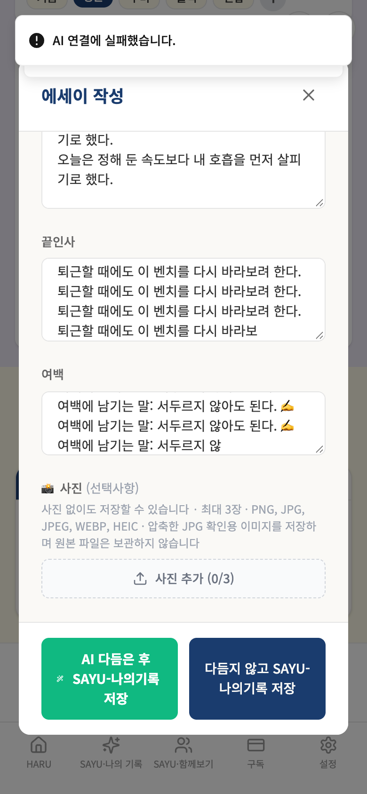

# 가상사용자 3차 배치 — 에세이·메모·업무일지 3칸

- 실행 ID: `2026-10-08T23-09-48` · 대상: 가상인물 3명 · 방식: **A단계(격리 검증)** — 실제 앱 화면을 모바일 브라우저로 조작하고 Firebase·AI만 모의 (운영 DB·AI·서버 접속 0건)
- 점검 121개 중 120개 충족, 1개 미충족 · 발견 1건(치명 0 / 중대 0 / 경미 1 / 제안 0 / 참고 0) · 실행 시간 합계 68.3초

## 작성 경위

허대표님 지시에 따라 CC 인수인계 통합본 `c7c6c8e3`를 기준으로 남은 16칸 중 에세이·메모·업무일지 3칸을 수행했다. 모든 인물·입력 내용은 허구다.

- 실행 앱 기준: 원격 `main` `eb1cc0862928722d4efaa249a1cb6d80d87fc747` (2026-10-09 KST clone 시점). 기존 작업 저장소와 브랜치는 보존하고 `/private/tmp/haru-persona-batch3`에 앱과 하네스를 분리 구성했다. 결과 커밋은 `/private/tmp/haru-persona-dev`의 `claude/elegant-noether-z5zy29`에만 반영한다.
- Mac Chrome / Chromium 모바일 390×844, `127.0.0.1:18762`. `.env`를 읽지 않는 하네스 설정과 Firebase SDK 모의를 사용했다. 운영 AI·외부 조회·데이터 읽기·쓰기는 수행하지 않았다.
- 사전 p14·p15·p16 스모크(`2026-10-08T22-57-59`, UTC): 각각 단계 19/25/23, 점검 32/58/43, 미충족 8/4/3, 발견 6/4/4. 인수인계 기대값과 모두 일치했다. 종료 1은 기존 발견에 따른 정상 결과다. 외부 요청 차단 0, 미모의 함수 0, 페이지 오류 0, 시나리오 중단 0.
- 첫 3칸 실행(`2026-10-08T23-01-35`, UTC)의 에세이 중단은 따옴표가 있는 placeholder를 기존 CSS 조합 도구로 찾으려 한 새 테스트 코드의 문제였다. 에세이 새 파일에서 `getByPlaceholder`로 수정했고 최종 3칸 실행으로 확인했다. 이 중단은 제품 발견에 포함하지 않는다. 첫 실행 메모 42개·업무일지 34개 점검은 모두 통과했다.
- 두 번째 실행(`2026-10-08T23-02-38`, UTC)에서 새 테스트가 오류 코드만 담는 `qa.calls.error`에 메시지를 기대하고, `fakes.ts`가 trim한 응답에 원본 마지막 공백까지 기대한 3개 항목은 테스트 기대값 오류였다. callable 코드+콘솔 오류 메시지 및 고정 모의 응답 규약으로 대조하도록 수정한 뒤 다시 실행했다. 이 3개 항목에 부여됐던 자동 발견은 제품 발견에서 제외하며, 기존 F-19 안내 문제만 재현으로 남긴다. 원본 입력 필드는 trim되지 않고 모두 그대로 저장됐다.
- 세 번째 실행(`2026-10-08T23-04-18`, UTC)의 미리보기 1개 미충족도 새 테스트의 읽기 방법 오류였다. 미리보기는 본문 텍스트 노드가 아니라 편집 가능한 textarea이므로 `innerText` 대신 해당 textarea의 `inputValue()`를 읽도록 수정했다. 저장된 모의 응답은 이미 고정값과 일치했다. 수정 후 최종 3칸 실행에서 이 항목을 재확인했다.
- 발견 번호는 기존 보고서와 대조한다. 기존 F-19 재현에 새 번호를 붙이지 않으며 새 발견이 있으면 F-26부터 배정한다. 앱 소스·기존 검토 기록·열린 리뷰 스레드는 변경하지 않았다.
- 이 보고서는 A단계 결과다. 실기기 Safari·운영 인증/Rules/저장·AI 품질의 완료 판정은 포함하지 않는다. 앱 빌드는 앱 소스 변경이 없어 이번 산출물 검증에 포함하지 않았고, 새 MJS 구문검사·실제 격리 실행·Git diff 검사를 수행했다.


## 먼저 볼 것

치명·중대 발견 없음.

## 1. 인물별 요약

| 인물 | 형식 | 나이·성별·직업 | 단계(실패) | 점검 충족/전체 | 발견 | 소요 |
|---|---|---|---|---|---|---|
| 박정훈 | 에세이 | 52세·남·중소기업 임원 | 10(0) | 44/45 | 1 | 26.4초 |
| 임수빈 | 메모 | 17세·여·고등학생 | 11(0) | 42/42 | 0 | 23.2초 |
| 강도현 | 업무일지 | 31세·남·스타트업 개발자 | 10(0) | 34/34 | 0 | 18.7초 |

## 2. 발견 사항 종합

| ID | 심각도 | 제목 | 형식·인물 |
|---|---|---|---|
| F-19 | 경미 | 긴 글에서 AI 다듬기가 안 될 때 "AI 연결에 실패했습니다."라고만 나와 원인(글자 수 초과)을 알 수 없다 | 에세이 / 박정훈 |

> 심각도: **치명**(데이터 손실·저장 실패) / **중대**(결과가 틀리게 보이거나 흐름이 막힘) / **경미**(불편·일관성) / **제안**(개선 아이디어·비용 확인) / **참고**(맥락 정보)

### F-19 [경미] 긴 글에서 AI 다듬기가 안 될 때 "AI 연결에 실패했습니다."라고만 나와 원인(글자 수 초과)을 알 수 없다

- 재현 인물: 박정훈(에세이) · 대표 단계: 프리미엄 긴 글 모의 AI 한도 오류·입력 유지
- 내용: 기존 F-19 재현. 에세이 6칸 본문 4,800자에 안내문이 붙어 모의 서버가 5,000자 한도 오류를 반환했지만 안내는 ["AI 연결에 실패했습니다.","에세이 AI 다듬기를 시작합니다... (PREMIUM 모드)"]였다. 앱 소스는 수정하지 않았다.
- 증거 화면: 

## 3. 인물별 상세

### 박정훈 — 에세이

| 항목 | 내용 |
|---|---|
| 나이·성별 | 52세 · 남 |
| 직업 | 중소기업 임원 |
| 기기 | Chromium 모바일 390×844 |
| IT 숙련도 | 중 |
| 요금제 | 무료 |
| 사용 목적 | 관찰부터 여백까지 여섯 칸에 긴 글을 쓰고 저장해 다시 읽는다. |

**시나리오**

1. 프리미엄 6칸 합계 4,800자 작성, 모의 5,000자 서버 한도 오류와 입력 유지 확인 후 원본 저장
2. 다음 날 간편 4,400자 모의 AI 미리보기 저장(품질은 평가하지 않음)
3. 같은 날 간편 6,000자 원본 저장, 두 기록이 덮어쓰이지 않는지 확인
4. 재접속 후 에세이 목록과 격리 확인

**실행 단계**

| # | 단계 | 결과 | 소요 | 화면에 뜬 안내 |
|---|---|---|---|---|
| 1 | 홈 → 에세이 → 프리미엄 6칸 작성 | 완료 | 7.5초 |  |
| 2 | 프리미엄 긴 글 모의 AI 한도 오류·입력 유지 | 완료 | 2.4초 | AI 연결에 실패했습니다. / 에세이 AI 다듬기를 시작합니다... (PREMIUM 모드) |
| 3 | 긴 프리미엄 원본 저장 | 완료 | 1.4초 | SAYU-나의 기록에 저장했습니다. / 내용이 저장되었습니다! / AI 연결에 실패했습니다. / 에세이 AI 다듬기를 시작합니다... (PREMIUM 모드) |
| 4 | 프리미엄 6칸 원본 저장 검증 | 완료 | 0.0초 | SAYU-나의 기록에 저장했습니다. / 내용이 저장되었습니다! / AI 연결에 실패했습니다. / 에세이 AI 다듬기를 시작합니다... (PREMIUM 모드) |
| 5 | 4,400자 간편 기록 모의 AI 저장 | 완료 | 4.9초 | SAYU-나의 기록에 저장했습니다. / 내용이 저장되었습니다! / AI 다듬기 완료! / 에세이 AI 다듬기를 시작합니다... (PREMIUM 모드) |
| 6 | 모의 AI 저장 후 원본·저장 경로 검증 | 완료 | 0.0초 | SAYU-나의 기록에 저장했습니다. / 내용이 저장되었습니다! / AI 다듬기 완료! / 에세이 AI 다듬기를 시작합니다... (PREMIUM 모드) |
| 7 | 같은 날 6,000자 원본 저장 | 완료 | 4.7초 | SAYU-나의 기록에 저장했습니다. / 내용이 저장되었습니다! |
| 8 | 긴 글 원본과 같은 날 두 기록 보존 검증 | 완료 | 0.0초 | SAYU-나의 기록에 저장했습니다. / 내용이 저장되었습니다! |
| 9 | 재접속 에세이 목록 확인 | 완료 | 4.1초 |  |
| 10 | 격리 확인 | 완료 | 0.0초 |  |

**점검 결과** — 충족 44 / 전체 45

| 미충족 점검 | 근거 |
|---|---|
| 한도 오류 안내가 글자 수 초과를 설명한다 | ["AI 연결에 실패했습니다.","에세이 AI 다듬기를 시작합니다... (PREMIUM 모드)"] |

**호출·저장 요약**

- 모의 서버 함수 호출: getMonthlyAiQuotaStatus 2회, polishContent 2회, recordPaidServiceUsage 3회
- 저장된 기록 문서: 3건 · 사진 업로드 0건
- 외부 요청 차단 0건 · 모의되지 않은 함수 없음 · 콘솔 오류 1건 · 페이지 오류 0건

### 임수빈 — 메모

| 항목 | 내용 |
|---|---|
| 나이·성별 | 17세 · 여 |
| 직업 | 고등학생 |
| 기기 | Chromium 모바일 390×844 |
| IT 숙련도 | 상 |
| 요금제 | 무료 |
| 사용 목적 | 짧은 메모와 이모지, 할 일을 빠르게 남기고 다시 본다. |

**시나리오**

1. 제목만 있고 내용이 빈 상태·공백만 입력한 상태에서 저장 방지 확인
2. 한 글자 메모 저장
3. 같은 날 이모지 한 개만 저장
4. 다음 날 체크박스·따옴표·HTML 모양·줄바꿈을 포함한 할 일 저장
5. 프리미엄 내용·다음 행동·여백 저장, 재접속 목록 확인

**실행 단계**

| # | 단계 | 결과 | 소요 | 화면에 뜬 안내 |
|---|---|---|---|---|
| 1 | 홈 → 메모 → 제목만 입력 후 저장 시도 | 완료 | 4.7초 | 저장할 내용이 없습니다. 먼저 작성해주세요. / 저장할 내용이 없습니다. 먼저 작성해주세요. |
| 2 | 한 글자 메모 저장 | 완료 | 1.3초 | SAYU-나의 기록에 저장했습니다. / 내용이 저장되었습니다! / 저장할 내용이 없습니다. 먼저 작성해주세요. / 저장할 내용이 없습니다. 먼저 작성해주세요. |
| 3 | 한 글자 메모 저장 검증 | 완료 | 0.0초 | SAYU-나의 기록에 저장했습니다. / 내용이 저장되었습니다! / 저장할 내용이 없습니다. 먼저 작성해주세요. / 저장할 내용이 없습니다. 먼저 작성해주세요. |
| 4 | 같은 날 이모지 하나만 저장 | 완료 | 4.0초 | SAYU-나의 기록에 저장했습니다. / 내용이 저장되었습니다! |
| 5 | 이모지와 같은 날 메모 보존 검증 | 완료 | 0.0초 | SAYU-나의 기록에 저장했습니다. / 내용이 저장되었습니다! |
| 6 | 특수문자·줄바꿈 할 일 메모 저장 | 완료 | 4.0초 | SAYU-나의 기록에 저장했습니다. / 내용이 저장되었습니다! |
| 7 | 할 일 메모 저장 검증 | 완료 | 0.0초 | SAYU-나의 기록에 저장했습니다. / 내용이 저장되었습니다! |
| 8 | 프리미엄 메모와 다음 행동 저장 | 완료 | 4.2초 | SAYU-나의 기록에 저장했습니다. / 내용이 저장되었습니다! |
| 9 | 프리미엄 메모 저장 검증 | 완료 | 0.0초 | SAYU-나의 기록에 저장했습니다. / 내용이 저장되었습니다! |
| 10 | 재접속 메모 목록 확인 | 완료 | 4.1초 |  |
| 11 | 격리 확인 | 완료 | 0.0초 |  |

**점검 결과** — 충족 42 / 전체 42

미충족 점검 없음.

**호출·저장 요약**

- 모의 서버 함수 호출: recordPaidServiceUsage 4회
- 저장된 기록 문서: 4건 · 사진 업로드 0건
- 외부 요청 차단 0건 · 모의되지 않은 함수 없음 · 콘솔 오류 0건 · 페이지 오류 0건

### 강도현 — 업무일지

| 항목 | 내용 |
|---|---|
| 나이·성별 | 31세 · 남 |
| 직업 | 스타트업 개발자 |
| 기기 | Chromium 모바일 390×844 |
| IT 숙련도 | 상 |
| 요금제 | 무료 |
| 사용 목적 | 시간표와 업무 결과를 줄바꿈 그대로 남기고 다시 확인한다. |

**시나리오**

1. 프리미엄 6칸 시간표·결과·보류·지표·평가·여백 작성
2. 같은 날 간편 기록으로 23:59 업무 마무리 저장
3. 다음 날 00:05부터 시작하는 기록, 시간·줄바꿈·특수문자 확인
4. 재접속 후 업무일지 목록과 격리 확인

**실행 단계**

| # | 단계 | 결과 | 소요 | 화면에 뜬 안내 |
|---|---|---|---|---|
| 1 | 홈 → 업무일지 → 프리미엄 6칸 작성 | 완료 | 3.8초 |  |
| 2 | 업무일지 프리미엄 원본 저장 | 완료 | 1.3초 | SAYU-나의 기록에 저장했습니다. / 내용이 저장되었습니다! |
| 3 | 시간표·줄바꿈·6칸 저장 검증 | 완료 | 0.0초 | SAYU-나의 기록에 저장했습니다. / 내용이 저장되었습니다! |
| 4 | 2026-10-03 23:59 간편 업무일지 저장 | 완료 | 4.5초 | SAYU-나의 기록에 저장했습니다. / 내용이 저장되었습니다! |
| 5 | 23:59 시간·본문·날짜 검증 | 완료 | 0.0초 | SAYU-나의 기록에 저장했습니다. / 내용이 저장되었습니다! |
| 6 | 2026-10-04 00:05 간편 업무일지 저장 | 완료 | 4.0초 | SAYU-나의 기록에 저장했습니다. / 내용이 저장되었습니다! |
| 7 | 00:05 시간·본문·날짜 검증 | 완료 | 0.0초 | SAYU-나의 기록에 저장했습니다. / 내용이 저장되었습니다! |
| 8 | 같은 날 두 업무일지가 덮어쓰이지 않는다 | 완료 | 0.0초 | SAYU-나의 기록에 저장했습니다. / 내용이 저장되었습니다! |
| 9 | 재접속 업무일지 목록 확인 | 완료 | 4.3초 |  |
| 10 | 격리 확인 | 완료 | 0.0초 |  |

**점검 결과** — 충족 34 / 전체 34

미충족 점검 없음.

**호출·저장 요약**

- 모의 서버 함수 호출: recordPaidServiceUsage 3회
- 저장된 기록 문서: 3건 · 사진 업로드 0건
- 외부 요청 차단 0건 · 모의되지 않은 함수 없음 · 콘솔 오류 0건 · 페이지 오류 0건

## 4. 격리·안전 확인

- 운영 Firebase·AI·결제 서버로 나간 요청: **0건** (하네스 서버 밖으로 향한 요청은 모두 차단·집계했고 차단 기록 자체가 없음)
- 저장은 브라우저 메모리(+localStorage)에만 남고 인물마다 별도 저장소를 쓴다. 운영 데이터를 읽거나 쓰지 않는다.
- AI 응답(다듬기·제목 등)은 모의값이라 **AI 결과의 품질은 이 보고서에서 평가하지 않았다.**

## 5. 이 시뮬레이션으로 알 수 없는 것

- AI 가 만든 글의 품질(원문 보존, 사실 추가, 마크다운 혼입 등) — 운영 서버 대상 C단계가 필요하다.
- 실제 아이폰 Safari 고유 문제 — Chromium 모바일 에뮬레이션(390×844)이며 글꼴도 Noto Sans KR 로 대체되어 줄바꿈 위치가 실기기와 다를 수 있다.
- 사람의 취향·구독 의사 — 가상인물은 실제 사용자보다 협조적이다. 실제 사용자 테스트를 병행해야 한다.
- 소셜 로그인·결제·푸시 알림·외부 조회(법제처·온비드 등) — 이 하네스의 범위가 아니다.

## 6. 시간·비용

| 인물 | 실행 시간 |
|---|---|
| 박정훈(에세이) | 26.4초 |
| 임수빈(메모) | 23.2초 |
| 강도현(업무일지) | 18.7초 |
| 합계 | 68.3초 |

- 기장 세션 토큰·요금 소비량: **미확인**(실측값 제공 도구 없음). 인수인계의 과거 CC 비용을 이번 세션 실측값으로 환산하지 않는다.
- 모의 함수 호출은 실제 AI 호출과 다르며, 실행 시간은 본문 표에 기록했다.
- npm/Chrome의 Mac 샌드박스 제한은 승인된 재실행으로 처리했다. 의존성·앱 설정 파일은 결과 커밋 대상에 포함하지 않았다.


## 7. 다음 단계

1. 위 발견 사항 중 어떤 것을 수정할지 결정한다(이 보고서는 앱 코드를 바꾸지 않았다).
2. 형식·비서별 가상인물을 같은 방식으로 늘린다(2안 22명 중 나머지).
3. AI 결과 품질·외부 조회가 필요한 항목은 운영 서버 대상 C단계로 따로 진행한다(비용·운영 데이터 사용이라 대표 승인 필요).

## 8. 다시 실행하는 방법

```bash
cd frontend/test/persona-sim
npm install            # 최초 1회 (playwright-core, 글꼴)
node runner/run.mjs    # 모든 인물 실행 (예: node runner/run.mjs p01 p13)
node runner/report.mjs # 최근 실행 결과로 이 보고서 다시 만들기
```

> 실행 결과 원본(스크린샷·result.json)은 `out/runs/<실행ID>/` 에 남고 git 에는 올리지 않는다. 이 보고서에는 발견 증거 캡처만 `img/` 로 복사한다.
