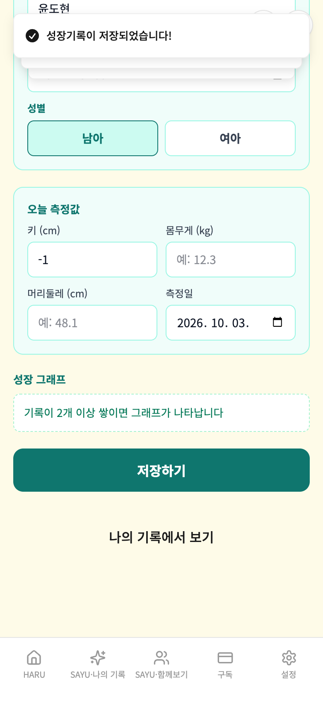

# 가상사용자 4차 — 반려동물·독서사유·성장기록

- 실행 ID: `2026-10-09T01-24-52` · 대상: 가상인물 3명 · 방식: **A단계(격리 검증)** — 실제 앱 화면을 모바일 브라우저로 조작하고 Firebase·AI만 모의 (운영 DB·AI·서버 접속 0건)
- 점검 92개 중 90개 충족, 2개 미충족 · 발견 1건(치명 0 / 중대 1 / 경미 0 / 제안 0 / 참고 0) · 실행 시간 합계 62.0초

## 작성 경위

기준 앱은 원격 main `4db3ce792da0a40678bd35afce8be74b696f1e9f`이다(실행 전후 원격 SHA 확인). 하네스만 개발 브랜치 `610495e2`에서 가져왔고 앱 소스·루트 package/lock을 변경하지 않았다. 별도 임시 clone `/private/tmp/haru-persona-batch4`에서 실행했다. 이전 배치 의존성을 재사용했으며 두 main 사이 package/lock diff는 없었다. 하네스 글꼴 의존성은 로컬 복사하여 Vite 허용 경로 밖 글꼴 오류를 제거했다.

최종 3명 22단계를 기준으로 판정하며 준비 실행은 calibration-runs.json에 별도로 기록한다. 첫 실행의 홈 카드 라벨(반려동물) 불일치·글꼴 경로, 두 번째의 잘못된 SAYU 기대값(별도 제목을 본문에 포함)·토스트 렌더 대기는 하네스 문제로 수정했다. 실제 이름·6칸은 모두 보존됐으므로 제품 결함으로 세지 않았다. 독서 AI는 기존 모의 polishContent만 사용하며 AI 결과 품질을 판정하지 않는다. 성장 백분위는 유한한 화면 표시와 키·몸무게 표시 여부를 확인했으며 의료 기준의 정확성은 별도 검증 범위다.

새 발견 F-26은 키 0·-1이 그대로 저장되는 동일 문제 2회 재현이다. 오류 값의 원문 DB·점검·화면을 verification.json 및 증거 이미지에 보존한다. 앱 수정은 하지 않았다. 배치 3칸을 추가하여 ①의 남은 칸은 13→10칸, 다음 발견 번호는 F-27이다. 실제 Firebase·Rules·실기기·운영 AI E2E와 PR #270 프리뷰 확인을 대신하지 않는다.


## 먼저 볼 것

실제 사용자가 마주치면 결과가 틀리게 보이거나 신뢰를 해칠 수 있는 항목입니다(근거 화면·코드 위치는 2절).

- **F-26** [중대] 성장기록이 0·음수 측정값을 검증하지 않고 저장한다

## 1. 인물별 요약

| 인물 | 형식 | 나이·성별·직업 | 단계(실패) | 점검 충족/전체 | 발견 | 소요 |
|---|---|---|---|---|---|---|
| 정하윤 | 애완동물관찰일지 | 29세·여·프리랜서 디자이너 | 8(0) | 41/41 | 0 | 23.7초 |
| 최민준 | 독서사유 | 21세·남·철학과 대학생 | 8(0) | 32/32 | 0 | 22.9초 |
| 윤태호 | 성장기록 | 40세·남·맞벌이 아빠 | 6(0) | 17/19 | 2 | 15.4초 |

## 2. 발견 사항 종합

| ID | 심각도 | 제목 | 형식·인물 |
|---|---|---|---|
| F-26 | 중대 | 성장기록이 0·음수 측정값을 검증하지 않고 저장한다 | 성장기록 / 윤태호 |

> 심각도: **치명**(데이터 손실·저장 실패) / **중대**(결과가 틀리게 보이거나 흐름이 막힘) / **경미**(불편·일관성) / **제안**(개선 아이디어·비용 확인) / **참고**(맥락 정보)

### F-26 [중대] 성장기록이 0·음수 측정값을 검증하지 않고 저장한다

- 재현 인물: 윤태호(성장기록) · 대표 단계: 0·음수 키 입력 시 저장 방지 확인
- 내용: 키 -1를 입력하고 저장하기를 누르자 1건이 증가했다. 저장 child_height=-1. 브라우저 input의 min=0과 별개로 저장 버튼이 값 유효성을 검사하지 않는다. ChildHealthGrowthPage.tsx handleSave는 빈 문자열만 검사하며, toPositiveNumber는 백분위 표시에서만 사용된다. (같은 인물에서 2회 재현: 0·음수 키 입력 시 저장 방지 확인)
- 증거 화면: 

## 3. 인물별 상세

### 정하윤 — 애완동물관찰일지

| 항목 | 내용 |
|---|---|
| 나이·성별 | 29세 · 여 |
| 직업 | 프리랜서 디자이너 |
| 기기 | Chromium 모바일 390×844 |
| IT 숙련도 | 상 |
| 요금제 | 무료 |
| 사용 목적 | 뭉치의 접종과 산책을 이름·사진과 함께 보존한다. |

**시나리오**

1. 간편 산책 기록
2. 프리미엄 이름·접종·건강·돌봄 6칸과 사진 1장
3. 다음 날 같은 반려견의 기록, 재접속 목록

**실행 단계**

| # | 단계 | 결과 | 소요 | 화면에 뜬 안내 |
|---|---|---|---|---|
| 1 | 홈 → 간편 반려동물 기록 저장 | 완료 | 8.9초 | SAYU-나의 기록에 저장했습니다. / 내용이 저장되었습니다! |
| 2 | 간편 저장 확인 | 완료 | 0.0초 | SAYU-나의 기록에 저장했습니다. / 내용이 저장되었습니다! |
| 3 | 2026-10-04 이름·접종·돌봄 기록 저장 | 완료 | 6.0초 | SAYU-나의 기록에 저장했습니다. / 내용이 저장되었습니다! / 1장의 사진이 업로드되었습니다! |
| 4 | 2026-10-04 이름·6칸 보존 확인 | 완료 | 0.0초 | SAYU-나의 기록에 저장했습니다. / 내용이 저장되었습니다! / 1장의 사진이 업로드되었습니다! |
| 5 | 2026-10-05 이름·접종·돌봄 기록 저장 | 완료 | 4.1초 | SAYU-나의 기록에 저장했습니다. / 내용이 저장되었습니다! |
| 6 | 2026-10-05 이름·6칸 보존 확인 | 완료 | 0.0초 | SAYU-나의 기록에 저장했습니다. / 내용이 저장되었습니다! |
| 7 | 재접속 목록 확인 | 완료 | 4.1초 |  |
| 8 | 격리 확인 | 완료 | 0.0초 |  |

**점검 결과** — 충족 41 / 전체 41

미충족 점검 없음.

**호출·저장 요약**

- 모의 서버 함수 호출: recordPaidServiceUsage 3회
- 저장된 기록 문서: 3건 · 사진 업로드 1건
- 외부 요청 차단 0건 · 모의되지 않은 함수 없음 · 콘솔 오류 0건 · 페이지 오류 0건

### 최민준 — 독서사유

| 항목 | 내용 |
|---|---|
| 나이·성별 | 21세 · 남 |
| 직업 | 철학과 대학생 |
| 기기 | Chromium 모바일 390×844 |
| IT 숙련도 | 상 |
| 요금제 | 무료 |
| 사용 목적 | 한 책을 세 번 이어 쓰고 초안을 복구한 뒤 마무리한다. |

**시나리오**

1. 빈 책 제목·저자 검증
2. 저장 전 초안 복구
3. 같은 책 3회 누적·제목 저자 잠금
4. 모의 AI 마무리·완료 후 이어쓰기 차단

**실행 단계**

| # | 단계 | 결과 | 소요 | 화면에 뜬 안내 |
|---|---|---|---|---|
| 1 | 홈 → 독서 새작성·필수 입력 검증 | 완료 | 3.8초 | 저자를 입력해 주세요. / 책 제목을 먼저 입력해 주세요. |
| 2 | 페이지 재접속 → 저장 전 초안 복구 | 완료 | 2.2초 |  |
| 3 | 1회차 독서장 저장 | 완료 | 1.9초 | 📖 독서장이 누적 저장되었습니다. / 내용이 저장되었습니다! / AI가 중간기록을 다듬는 중... |
| 4 | 2회차 독서장 저장 | 완료 | 4.0초 | 📖 독서장이 누적 저장되었습니다. / 내용이 저장되었습니다! / AI가 중간기록을 다듬는 중... |
| 5 | 3회차 독서장 저장 | 완료 | 4.0초 | 📖 독서장이 누적 저장되었습니다. / 내용이 저장되었습니다! / AI가 중간기록을 다듬는 중... |
| 6 | 모의 AI 마무리 분석과 최종 저장 | 완료 | 4.2초 | SAYU-나의기록에 저장되었습니다. / 내용이 저장되었습니다! / 독서사유 마무리 분석이 준비되었습니다. |
| 7 | 마무리한 책 재접속·이어작성 차단 | 완료 | 2.1초 |  |
| 8 | 격리 확인 | 완료 | 0.0초 |  |

**점검 결과** — 충족 32 / 전체 32

미충족 점검 없음.

**호출·저장 요약**

- 모의 서버 함수 호출: polishContent 4회, recordPaidServiceUsage 4회
- 저장된 기록 문서: 4건 · 사진 업로드 0건
- 외부 요청 차단 0건 · 모의되지 않은 함수 없음 · 콘솔 오류 0건 · 페이지 오류 0건

### 윤태호 — 성장기록

| 항목 | 내용 |
|---|---|
| 나이·성별 | 40세 · 남 |
| 직업 | 맞벌이 아빠 |
| 기기 | Chromium 모바일 390×844 |
| IT 숙련도 | 중 |
| 요금제 | 무료 |
| 사용 목적 | 5세 아들의 키·몸무게를 소수점까지 남기고 백분위와 저장 내용을 확인한다. |

**시나리오**

1. 홈 비서 → 건강정보 동의 → 성장기록
2. 빈 이름·빈 측정값·0·음수 입력
3. 키 110.5cm·몸무게 18.2kg 저장·백분위
4. 재접속 기존 아이 선택·두 번째 기록·SAYU 확인

**실행 단계**

| # | 단계 | 결과 | 소요 | 화면에 뜬 안내 |
|---|---|---|---|---|
| 1 | 홈 → 우리아이건강돌봄 → 성장기록·동의 | 완료 | 4.6초 |  |
| 2 | 빈 이름·빈 수치 입력 방지 | 완료 | 2.2초 | 키, 몸무게, 머리둘레 중 하나 이상 입력해 주세요. / 아이 이름을 입력하거나 선택해 주세요. |
| 3 | 0·음수 키 입력 시 저장 방지 확인 | 완료 | 2.2초 | 성장기록이 저장되었습니다! / 성장기록이 저장되었습니다! / 키, 몸무게, 머리둘레 중 하나 이상 입력해 주세요. |
| 4 | 정상 소수점·백분위 표시·저장 | 완료 | 1.2초 | 성장기록이 저장되었습니다! / 성장기록이 저장되었습니다! / 성장기록이 저장되었습니다! |
| 5 | 재접속 기존 아이 선택·두 번째 정상 측정 저장 | 완료 | 4.9초 | 성장기록이 저장되었습니다! |
| 6 | 격리 확인 | 완료 | 0.0초 | 성장기록이 저장되었습니다! |

**점검 결과** — 충족 17 / 전체 19

| 미충족 점검 | 근거 |
|---|---|
| 0·음수 성장 측정값은 저장되지 않는다 | 입력 0, 이전 0건 → 1건 |
| 0·음수 성장 측정값은 저장되지 않는다 | 입력 -1, 이전 1건 → 2건 |

**호출·저장 요약**

- 모의 서버 함수 호출: recordPaidServiceUsage 4회
- 저장된 기록 문서: 4건 · 사진 업로드 0건
- 외부 요청 차단 0건 · 모의되지 않은 함수 없음 · 콘솔 오류 0건 · 페이지 오류 0건

## 4. 격리·안전 확인

- 운영 Firebase·AI·결제 서버로 나간 요청: **0건** (하네스 서버 밖으로 향한 요청은 모두 차단·집계했고 차단 기록 자체가 없음)
- 저장은 브라우저 메모리(+localStorage)에만 남고 인물마다 별도 저장소를 쓴다. 운영 데이터를 읽거나 쓰지 않는다.
- AI 응답(다듬기·제목 등)은 모의값이라 **AI 결과의 품질은 이 보고서에서 평가하지 않았다.**

## 5. 이 시뮬레이션으로 알 수 없는 것

- AI 가 만든 글의 품질(원문 보존, 사실 추가, 마크다운 혼입 등) — 운영 서버 대상 C단계가 필요하다.
- 실제 아이폰 Safari 고유 문제 — Chromium 모바일 에뮬레이션(390×844)이며 글꼴도 Noto Sans KR 로 대체되어 줄바꿈 위치가 실기기와 다를 수 있다.
- 사람의 취향·구독 의사 — 가상인물은 실제 사용자보다 협조적이다. 실제 사용자 테스트를 병행해야 한다.
- 소셜 로그인·결제·푸시 알림·외부 조회(법제처·온비드 등) — 이 하네스의 범위가 아니다.

## 6. 시간·비용

| 인물 | 실행 시간 |
|---|---|
| 정하윤(애완동물관찰일지) | 23.7초 |
| 최민준(독서사유) | 22.9초 |
| 윤태호(성장기록) | 15.4초 |
| 합계 | 62.0초 |

소비량·요금 실측: 미확인. 운영 AI 호출 없음.

## 7. 다음 단계

1. 위 발견 사항 중 어떤 것을 수정할지 결정한다(이 보고서는 앱 코드를 바꾸지 않았다).
2. 형식·비서별 가상인물을 같은 방식으로 늘린다(2안 22명 중 나머지).
3. AI 결과 품질·외부 조회가 필요한 항목은 운영 서버 대상 C단계로 따로 진행한다(비용·운영 데이터 사용이라 대표 승인 필요).

## 8. 다시 실행하는 방법

```bash
cd frontend/test/persona-sim
npm install            # 최초 1회 (playwright-core, 글꼴)
node runner/run.mjs    # 모든 인물 실행 (예: node runner/run.mjs p01 p13)
node runner/report.mjs # 최근 실행 결과로 이 보고서 다시 만들기
```

> 실행 결과 원본(스크린샷·result.json)은 `out/runs/<실행ID>/` 에 남고 git 에는 올리지 않는다. 이 보고서에는 발견 증거 캡처만 `img/` 로 복사한다.
