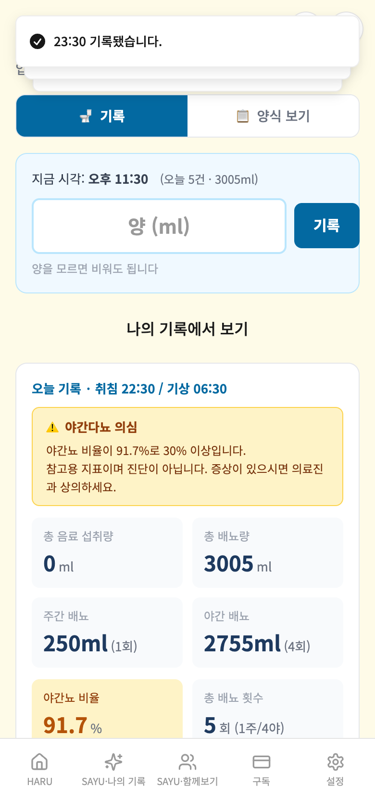

# 가상사용자 5차 — 배뇨일지·하루LAW·성장타임라인

- 실행 ID: `2026-10-09T03-11-04` · 대상: 가상인물 3명 · 방식: **A단계(격리 검증)** — 실제 앱 화면을 모바일 브라우저로 조작하고 Firebase·AI만 모의 (운영 DB·AI·서버 접속 0건)
- 점검 62개 중 59개 충족, 3개 미충족 · 발견 2건(치명 0 / 중대 2 / 경미 0 / 제안 0 / 참고 0) · 실행 시간 합계 46.8초

## 작성 경위

**기준과 범위**: 앱 main `4db3ce792da0a40678bd35afce8be74b696f1e9f`, 하네스 개발 브랜치 `a7037b9ed6ac331690415004ae02b28157e7af88`. 임시 clone `/private/tmp/haru-persona-batch5`에서 모의 SDK로 실행했다. 앱 소스는 수정하지 않았다. ① 이번 3칸 검증 후 남은 7칸이며 다음 발견은 F-29다. ③ 미허용, 운영 AI·외부 조회 C단계 금지, ②는 ① 완료 뒤 착수한다.

**최종 결과**: 20단계 중단·단계 실패 0, 62점검 중 59충족. 미충족 3회는 F-27 2회·F-28 1회다. 외부 요청·미모의 함수·페이지 실행 오류 0. 콘솔 기록은 3건: 배뇨 양식의 React key 경고 1건과 의도적으로 주입한 PDF 실패 로그 2건. 콘솔 0으로 판정하지 않는다. React key 경고는 `SayuHealthVoidingPage.tsx` 시간표 map의 key 없는 Fragment(570행)에 해당하며 이번에는 제품 중대 발견과 구분해 진단으로 보존한다.

**타임라인 PDF**: 현재 구현은 표지 1페이지 + 사진 4장/페이지다(인수인계문의 6장과 다름). 성공 PDF 응답은 고정 로컬 URL로 모의하고 `window.open`을 기록하는 것으로 확인했다. 실패 모의 응답 뒤 앱이 만드는 인쇄 DOM에서 Playwright PDF를 출력했다. 7장=3페이지(표지+4·3), 13장=5페이지(표지+4·4·4·1), Poppler 전체 페이지 렌더 육안 점검에서 사진 누락·빈 페이지 없음. 실제 서버 PDF 생성·운영 다운로드·실기기 인쇄 품질은 미검증. 편집용 입력란·미작성 placeholder가 PDF에 보이고 마지막 페이지 하단에 연보라색 여백이 관찰됨: 이 검증은 페이지 수·사진 누락 확인이며 완성 문서 디자인 합격 판정은 아니다. 모의 제목 결과는 품질 평가에서 제외했다. 타임라인 메모는 한 줄 입력란이며 줄바꿈 지원을 요구하지 않았다.

**하루LAW**: 빈 질문 호출 방지, 결과 없음·통신 실패 후 질문 보존, 모의 분석 표시, 빈 저장 날짜 방지, 선택 날짜 저장, 기존 메모 형식·본문·필드 보존, 재접속 확인. 모의 법령은 실제 법률 정보가 아니며 법률 결과의 정확성·서버 호출 비용은 평가하지 않았다.

**검증 명령**: `PERSONA_SIM_CHROMIUM='/Applications/Google Chrome.app/Contents/MacOS/Google Chrome' node runner/run.mjs p23 p24 p25` → 종료 1(제품 발견 2건, 중단 없음). 인물 3파일 `node --check`, `git diff --check` 통과. 앱 소스 변경이 없어 전체 앱 빌드는 요구하지 않았다. Firestore 경로·Functions 리전·Rules·환경변수·결제·인증 변경 없음. main 병합·운영 배포 없음. PR #270 HEAD `1dacf47c`의 CI·프리뷰 성공, Codex 주요 지적 없음 상태 유지. 독립 Claude 검토·대표님 프리뷰 확인은 여전히 대기다.


## 먼저 볼 것

실제 사용자가 마주치면 결과가 틀리게 보이거나 신뢰를 해칠 수 있는 항목입니다(근거 화면·코드 위치는 2절).

- **F-27** [중대] 배뇨일지 소수·음수 입력에서 기호를 제거해 다른 수량을 저장한다
- **F-28** [중대] 배뇨일지 새벽 기록이 한국 날짜보다 하루 전 날짜에 저장된다

## 1. 인물별 요약

| 인물 | 형식 | 나이·성별·직업 | 단계(실패) | 점검 충족/전체 | 발견 | 소요 |
|---|---|---|---|---|---|---|
| 조영수 | 배뇨일지 | 66세·남·은퇴 교사 | 6(0) | 12/15 | 3 | 17.4초 |
| 노경수 | 하루LAW | 49세·남·식당 사장 | 6(0) | 18/18 | 0 | 7.5초 |
| 신아름 | 성장타임라인 | 33세·여·아이 사진을 많이 찍는 엄마 | 8(0) | 29/29 | 0 | 21.9초 |

## 2. 발견 사항 종합

| ID | 심각도 | 제목 | 형식·인물 |
|---|---|---|---|
| F-27 | 중대 | 배뇨일지 소수·음수 입력에서 기호를 제거해 다른 수량을 저장한다 | 배뇨일지 / 조영수 |
| F-28 | 중대 | 배뇨일지 새벽 기록이 한국 날짜보다 하루 전 날짜에 저장된다 | 배뇨일지 / 조영수 |

> 심각도: **치명**(데이터 손실·저장 실패) / **중대**(결과가 틀리게 보이거나 흐름이 막힘) / **경미**(불편·일관성) / **제안**(개선 아이디어·비용 확인) / **참고**(맥락 정보)

### F-27 [중대] 배뇨일지 소수·음수 입력에서 기호를 제거해 다른 수량을 저장한다

- 재현 인물: 조영수(배뇨일지) · 대표 단계: 소수·음수 수량 실수 처리
- 내용: 입력 250.5가 화면에서 2505로 변하고 amountMl=2505로 저장됐다. SayuHealthVoidingPage.tsx onChange의 replace(/[^0-9]/g, '')와 handleQuickRecord의 parseInt가 원인이다. 빈 수량 0 허용과는 별개다. (같은 인물에서 2회 재현: 소수·음수 수량 실수 처리)
- 증거 화면: 

### F-28 [중대] 배뇨일지 새벽 기록이 한국 날짜보다 하루 전 날짜에 저장된다

- 재현 인물: 조영수(배뇨일지) · 대표 단계: 한국시간 자정 이후 기록일 확인
- 내용: 한국시간 2026-10-04 02:00에 200ml를 기록하자 date=2026-10-03 문서에 추가됐다. SayuHealthVoidingPage.tsx getTodayStr()의 new Date().toISOString().slice(0,10)은 UTC 날짜를 사용하고 시간 문자열은 getHours/getMinutes로 현지 시간을 사용한다. 한국시간 자정~08:59의 날짜와 시간이 어긋난다.
- 증거 화면: 

## 3. 인물별 상세

### 조영수 — 배뇨일지

| 항목 | 내용 |
|---|---|
| 나이·성별 | 66세 · 남 |
| 직업 | 은퇴 교사 |
| 기기 | Chromium 모바일 390×844 |
| IT 숙련도 |  |
| 요금제 | 무료 |
| 사용 목적 | 하루 배뇨량·주야간 합계를 검산하고 입력 실수와 재접속을 확인한다. |

**시나리오**

1. 홈·건강정보 동의·배뇨일지
2. 250·150ml 주야간 기록·재접속
3. 빈 값·소수·음수 입력 실수
4. 양식·저장 경로·격리

**실행 단계**

| # | 단계 | 결과 | 소요 | 화면에 뜬 안내 |
|---|---|---|---|---|
| 1 | 홈 → 건강관리 → 동의 → 배뇨일지 | 완료 | 6.3초 |  |
| 2 | 주간 250ml·야간 150ml 기록·검산 | 완료 | 3.6초 | 23:30 기록됐습니다. |
| 3 | 재접속·양식 표시·빈 수량 허용 | 완료 | 3.1초 | 23:30 기록됐습니다. |
| 4 | 소수·음수 수량 실수 처리 | 완료 | 1.1초 | 23:30 기록됐습니다. / 23:30 기록됐습니다. / 23:30 기록됐습니다. |
| 5 | 한국시간 자정 이후 기록일 확인 | 완료 | 3.0초 | 02:00 기록됐습니다. |
| 6 | 격리 확인 | 완료 | 0.0초 | 02:00 기록됐습니다. |

**점검 결과** — 충족 12 / 전체 15

| 미충족 점검 | 근거 |
|---|---|
| 잘못 입력한 수량을 다른 양수 정수로 바꾸어 저장하지 않는다 | 입력 250.5 → 표시 2505 → 저장 [{"id":"mushnzza6dzz","time":"23:30","type":"void","amountMl":2505}] |
| 잘못 입력한 수량을 다른 양수 정수로 바꾸어 저장하지 않는다 | 입력 -100 → 표시 100 → 저장 [{"id":"musho0eljrt1","time":"23:30","type":"void","amountMl":100}] |
| 한국시간 10월4일 새벽 기록은 10월4일에 저장된다 | KST=2026-10-04 02:00, 저장일=2026-10-03 |

**호출·저장 요약**

- 모의 서버 함수 호출: recordPaidServiceUsage 6회
- 저장된 기록 문서: 1건 · 사진 업로드 0건
- 외부 요청 차단 0건 · 모의되지 않은 함수 없음 · 콘솔 오류 1건 · 페이지 오류 0건

### 노경수 — 하루LAW

| 항목 | 내용 |
|---|---|
| 나이·성별 | 49세 · 남 |
| 직업 | 식당 사장 |
| 기기 | Chromium 모바일 390×844 |
| IT 숙련도 |  |
| 요금제 | 무료 |
| 사용 목적 | 질문·분석·오류·저장 흐름을 모의 응답으로 확인한다. |

**시나리오**

1. 홈 하루LAW·안내·빈 입력
2. 결과 없음·통신 오류·질문 보존
3. 질문 분석 표시·날짜 검증·저장
4. 기존 같은 날짜 기록 보존·재접속

**실행 단계**

| # | 단계 | 결과 | 소요 | 화면에 뜬 안내 |
|---|---|---|---|---|
| 1 | 홈 → 하루LAW 안내·질문 입력 | 완료 | 2.3초 |  |
| 2 | [모의 결과 없음] 응답·입력 보존 | 완료 | 0.7초 |  |
| 3 | [모의 오류] 응답·입력 보존 | 완료 | 0.7초 |  |
| 4 | 모의 결과·원질문 표시·빈 저장 날짜 방지 | 완료 | 1.0초 |  |
| 5 | 기존 날짜 기록과 함께 분석 저장 | 완료 | 2.4초 |  |
| 6 | 격리 확인 | 완료 | 0.0초 |  |

**점검 결과** — 충족 18 / 전체 18

미충족 점검 없음.

**호출·저장 요약**

- 모의 서버 함수 호출: lawSearch 3회, recordPaidServiceUsage 1회
- 저장된 기록 문서: 1건 · 사진 업로드 0건
- 외부 요청 차단 0건 · 모의되지 않은 함수 없음 · 콘솔 오류 0건 · 페이지 오류 0건

### 신아름 — 성장타임라인

| 항목 | 내용 |
|---|---|
| 나이·성별 | 33세 · 여 |
| 직업 | 아이 사진을 많이 찍는 엄마 |
| 기기 | Chromium 모바일 390×844 |
| IT 숙련도 |  |
| 요금제 | 무료 |
| 사용 목적 | 7·13장 문서·메모·날짜·저장과 PDF 요청 및 브라우저 인쇄 분할을 확인한다. |

**시나리오**

1. 홈 타임라인·빈 사진 방지
2. 7장 사진·날짜·메모·문서·모의 PDF 요청·저장
3. 13장·모의 PDF 실패→인쇄 4장 분할·저장
4. 재접속·격리

**실행 단계**

| # | 단계 | 결과 | 소요 | 화면에 뜬 안내 |
|---|---|---|---|---|
| 1 | 홈 타임라인·빈 사진 생성 방지 | 완료 | 2.9초 |  |
| 2 | 7장 사진·날짜·메모 입력 | 완료 | 1.9초 | 7장의 사진을 불러왔습니다. |
| 3 | 7장 문서 미리보기·PDF 흐름 | 완료 | 4.6초 | 서버 PDF 생성에 실패해 브라우저 PDF 저장으로 전환합니다. / PDF를 생성해 서버에 저장했습니다. |
| 4 | 7장 최종 저장·저장 경로 확인 | 완료 | 1.5초 | SAYU·나의 기록에서 확인하실 수 있습니다. |
| 5 | 13장 사진·날짜·메모 입력 | 완료 | 2.0초 | 13장의 사진을 불러왔습니다. |
| 6 | 13장 문서 미리보기·PDF 흐름 | 완료 | 3.0초 | 서버 PDF 생성에 실패해 브라우저 PDF 저장으로 전환합니다. |
| 7 | 13장 최종 저장·저장 경로 확인 | 완료 | 1.6초 | SAYU·나의 기록에서 확인하실 수 있습니다. / 서버 PDF 생성에 실패해 브라우저 PDF 저장으로 전환합니다. |
| 8 | 재접속 두 문서·격리 확인 | 완료 | 2.0초 |  |

**점검 결과** — 충족 29 / 전체 29

미충족 점검 없음.

**호출·저장 요약**

- 모의 서버 함수 호출: generateGrowthTimelinePdf 3회, extractTitle 2회, recordPaidServiceUsage 2회
- 저장된 기록 문서: 2건 · 사진 업로드 20건
- 외부 요청 차단 0건 · 모의되지 않은 함수 없음 · 콘솔 오류 2건 · 페이지 오류 0건

## 4. 격리·안전 확인

- 운영 Firebase·AI·결제 서버로 나간 요청: **0건** (하네스 서버 밖으로 향한 요청은 모두 차단·집계했고 차단 기록 자체가 없음)
- 저장은 브라우저 메모리(+localStorage)에만 남고 인물마다 별도 저장소를 쓴다. 운영 데이터를 읽거나 쓰지 않는다.
- AI 응답(다듬기·제목 등)은 모의값이라 **AI 결과의 품질은 이 보고서에서 평가하지 않았다.**

## 5. 이 시뮬레이션으로 알 수 없는 것

- AI 가 만든 글의 품질(원문 보존, 사실 추가, 마크다운 혼입 등) — 운영 서버 대상 C단계가 필요하다.
- 실제 아이폰 Safari 고유 문제 — Chromium 모바일 에뮬레이션(390×844)이며 글꼴도 Noto Sans KR 로 대체되어 줄바꿈 위치가 실기기와 다를 수 있다.
- 사람의 취향·구독 의사 — 가상인물은 실제 사용자보다 협조적이다. 실제 사용자 테스트를 병행해야 한다.
- 소셜 로그인·결제·푸시 알림·외부 조회(법제처·온비드 등) — 이 하네스의 범위가 아니다.

## 6. 시간·비용

| 인물 | 실행 시간 |
|---|---|
| 조영수(배뇨일지) | 17.4초 |
| 노경수(하루LAW) | 7.5초 |
| 신아름(성장타임라인) | 21.9초 |
| 합계 | 46.8초 |

소비량·요금 실측: 미확인. 난이도: 5.5 중간.

## 7. 다음 단계

1. 위 발견 사항 중 어떤 것을 수정할지 결정한다(이 보고서는 앱 코드를 바꾸지 않았다).
2. 형식·비서별 가상인물을 같은 방식으로 늘린다(2안 22명 중 나머지).
3. AI 결과 품질·외부 조회가 필요한 항목은 운영 서버 대상 C단계로 따로 진행한다(비용·운영 데이터 사용이라 대표 승인 필요).

## 8. 다시 실행하는 방법

```bash
cd frontend/test/persona-sim
npm install            # 최초 1회 (playwright-core, 글꼴)
node runner/run.mjs    # 모든 인물 실행 (예: node runner/run.mjs p01 p13)
node runner/report.mjs # 최근 실행 결과로 이 보고서 다시 만들기
```

> 실행 결과 원본(스크린샷·result.json)은 `out/runs/<실행ID>/` 에 남고 git 에는 올리지 않는다. 이 보고서에는 발견 증거 캡처만 `img/` 로 복사한다.
