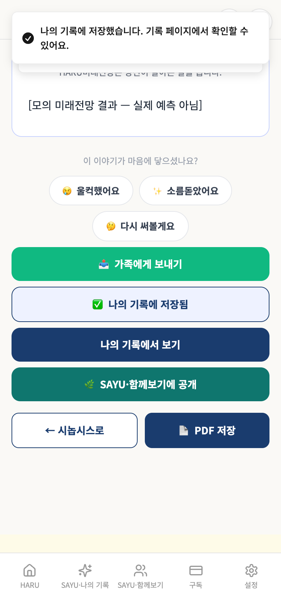
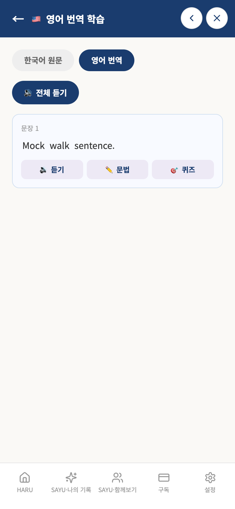
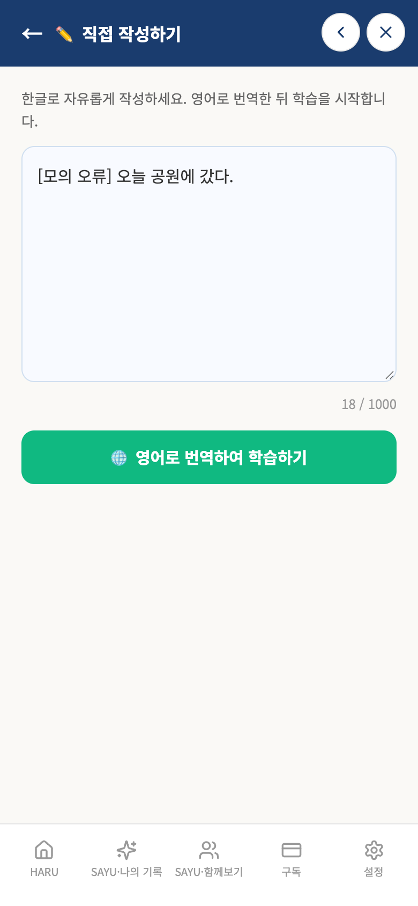

# 가상사용자 6차 검증 — 미래전망·전자소송연습·영어일기

- 실행 ID: `2026-10-09T03-35-01` · 대상: 가상인물 3명 · 방식: **A단계(격리 검증)** — 실제 앱 화면을 모바일 브라우저로 조작하고 Firebase·AI만 모의 (운영 DB·AI·서버 접속 0건)
- 점검 56개 중 53개 충족, 3개 미충족 · 발견 3건(치명 0 / 중대 2 / 경미 1 / 제안 0 / 참고 0) · 실행 시간 합계 54.4초

## 작성 경위

① 남은 7칸 중 미래전망·전자소송연습·영어일기 3칸을 추가 검증했다. 누계 18/22칸, 남은 4칸이다. main 4db3ce792da0a40678bd35afce8be74b696f1e9f detached clone에 개발 브랜치 91e03b9031026240ab23d47401c06c40efa62192의 하네스만 복사했다. 앱 소스·운영 데이터 수정, 실제 AI·법원·외부 API 호출, 병합·배포는 없었다.

390×844 Chromium 모바일 에뮬레이션이며 실제 Safari 검증은 아니다. AI 응답은 고정 모의이고 품질·법률 판단 검증이 아니다. 미래전망과 영어일기는 합성 기존 기록을 사용했다. 영어일기의 같은 길이 본문 변경은 수정 후 DB fixture로 재현했으며 실제 SAYU 편집 과정은 포함하지 않았다. 전자소송은 현재 지원되는 대여금 반환 사례로 초보 안내→포털 인증 연습→법률정보 동의→작성→모의 제출→사건 저장을 확인했다.

시나리오 보정 중단·폰트 경로 오류는 calibration-runs.json에 별도로 남기고 최종 제품 발견에서 제외했다. 최종 원본 결과·저장 fixture는 verification.json, 증거 무결성은 sha256.json을 참조한다. 앱 변경이 없어 전체 앱 빌드는 실행하지 않았다. 경로·리전·Rules·환경변수·결제·인증 구현 변경 없음.

PR #270은 허대표님이 제공한 10월 9일 스크린샷에서 기존 법률 메모에 하루LAW 카드 1장만 표시되고 생활·육아 카드는 없는 기준을 확인했다. 독립 Claude 검토는 대기 상태이며 병합·운영 배포 승인으로 간주하지 않는다.


## 먼저 볼 것

실제 사용자가 마주치면 결과가 틀리게 보이거나 신뢰를 해칠 수 있는 항목입니다(근거 화면·코드 위치는 2절).

- **F-29** [중대] 기록합본으로 만든 미래전망이 날짜 범위 문자열을 기록일로 저장한다
- **F-30** [중대] 영어일기는 본문을 같은 글자 수로 바꾸면 이전 번역 캐시를 계속 사용한다

## 1. 인물별 요약

| 인물 | 형식 | 나이·성별·직업 | 단계(실패) | 점검 충족/전체 | 발견 | 소요 |
|---|---|---|---|---|---|---|
| 김정호 | HARU미래전망 | 62세·남·은퇴를 앞둔 공무원 | 5(0) | 19/20 | 1 | 21.5초 |
| 박성민 | 전자소송연습 | 38세·남·직장인 | 6(0) | 17/17 | 0 | 16.3초 |
| 정은희 | 영어일기 | 45세·여·주부 | 6(0) | 17/19 | 2 | 16.6초 |

## 2. 발견 사항 종합

| ID | 심각도 | 제목 | 형식·인물 |
|---|---|---|---|
| F-29 | 중대 | 기록합본으로 만든 미래전망이 날짜 범위 문자열을 기록일로 저장한다 | HARU미래전망 / 김정호 |
| F-30 | 중대 | 영어일기는 본문을 같은 글자 수로 바꾸면 이전 번역 캐시를 계속 사용한다 | 영어일기 / 정은희 |
| F-31 | 경미 | 영어일기 번역 실패가 콘솔에만 기록되고 화면에는 오류 안내가 없다 | 영어일기 / 정은희 |

> 심각도: **치명**(데이터 손실·저장 실패) / **중대**(결과가 틀리게 보이거나 흐름이 막힘) / **경미**(불편·일관성) / **제안**(개선 아이디어·비용 확인) / **참고**(맥락 정보)

### F-29 [중대] 기록합본으로 만든 미래전망이 날짜 범위 문자열을 기록일로 저장한다

- 재현 인물: 김정호(HARU미래전망) · 대표 단계: 일기 합본 2편 선택·모의 생성·저장
- 내용: 2편 합본 생성 뒤 저장한 date=2026-10-01 ~ 2026-10-02, path=users/qa-p26-kim-jungho/records/2026-10-01 ~ 2026-10-02_1791030620851. ProphecyFromRecord의 합본 selectedRecord.date 범위 문자열을 NovelStoryPage buildStoryRecord가 publishDate=recordDate||today로 그대로 저장한다.
- 증거 화면: 

### F-30 [중대] 영어일기는 본문을 같은 글자 수로 바꾸면 이전 번역 캐시를 계속 사용한다

- 재현 인물: 정은희(영어일기) · 대표 단계: 같은 글자 수 본문 변경 fixture·캐시 무효화
- 내용: 기존 '오늘 산책을 했다.'를 번역한 상태에서 기존 사용자의 수정 후 상태를 fixture로 '오늘 독서를 했다.'로 구성했다. 상세 원문은 변경됐지만 번역 호출은 3→3, 학습 화면은 이전 Mock walk sentence.를 표시했다. DiaryLearnPage handleTranslate 캐시 조건은 문장 존재·본문 길이만 비교한다. 실제 SAYU 편집 화면의 수정 동작은 이번 fixture 검증에 포함하지 않았다.
- 증거 화면: 

### F-31 [경미] 영어일기 번역 실패가 콘솔에만 기록되고 화면에는 오류 안내가 없다

- 재현 인물: 정은희(영어일기) · 대표 단계: 모의 번역 실패·입력 보존·오류 안내
- 내용: translateToEnglish가 functions/unavailable을 반환하자 입력은 유지되고 번역 버튼만 복원됐다. 토스트·화면 오류 안내는 없었다. DiaryLearnPage handleDirectTranslate의 catch는 console.error만 실행한다.
- 증거 화면: 

## 3. 인물별 상세

### 김정호 — HARU미래전망

| 항목 | 내용 |
|---|---|
| 나이·성별 | 62세 · 남 |
| 직업 | 은퇴를 앞둔 공무원 |
| 기기 | Chromium 모바일 390×844 |
| IT 숙련도 |  |
| 요금제 | 무료 |
| 사용 목적 | 내 기록 한 편과 기간 합본으로 전망 흐름·이름·나이·저장 내용을 확인한다. |

**시나리오**

1. 홈·미래전망 두 진입점·빈 기록
2. 기존 단일 기록·모의 분석·설정·이야기 저장
3. 기간 합본·모의 생성·저장 날짜
4. 재접속·격리

**실행 단계**

| # | 단계 | 결과 | 소요 | 화면에 뜬 안내 |
|---|---|---|---|---|
| 1 | 홈 미래전망·빈 기록 | 완료 | 8.5초 |  |
| 2 | 합성 기존 일기 2편 준비·단일 선택 | 완료 | 2.6초 |  |
| 3 | 단일 기록·모의 생성·저장 | 완료 | 3.3초 | 나의 기록에 저장했습니다. 기록 페이지에서 확인할 수 있어요. / 시놉시스가 생성되었습니다! |
| 4 | 일기 합본 2편 선택·모의 생성·저장 | 완료 | 6.7초 | 나의 기록에 저장했습니다. 기록 페이지에서 확인할 수 있어요. / 시놉시스가 생성되었습니다! |
| 5 | 격리 확인 | 완료 | 0.0초 | 나의 기록에 저장했습니다. 기록 페이지에서 확인할 수 있어요. / 시놉시스가 생성되었습니다! |

**점검 결과** — 충족 19 / 전체 20

| 미충족 점검 | 근거 |
|---|---|
| 합본에서 생성한 전망의 저장 date는 YYYY-MM-DD이다 | 저장 date=2026-10-01 ~ 2026-10-02 |

**호출·저장 요약**

- 모의 서버 함수 호출: analyzeRecordForProphecy 2회, generateHaruProphecy 4회, recordPaidServiceUsage 2회
- 저장된 기록 문서: 4건 · 사진 업로드 0건
- 외부 요청 차단 0건 · 모의되지 않은 함수 없음 · 콘솔 오류 0건 · 페이지 오류 0건

### 박성민 — 전자소송연습

| 항목 | 내용 |
|---|---|
| 나이·성별 | 38세 · 남 |
| 직업 | 직장인 |
| 기기 | Chromium 모바일 390×844 |
| IT 숙련도 |  |
| 요금제 | 무료 |
| 사용 목적 | 현재 지원되는 대여금 반환 사례로 절차 연습·모의 AI 초안·사건 저장을 확인한다. |

**시나리오**

1. 홈·초보 안내·법률정보 동의·인증 연습
2. 동의 방지·사건·금액·당사자·청구 입력
3. 모의 AI 초안·수동 입력·증거·검토·모의 제출
4. 제출준비 사건 저장·재접속·격리

**실행 단계**

| # | 단계 | 결과 | 소요 | 화면에 뜬 안내 |
|---|---|---|---|---|
| 1 | 홈 → 초보 안내 → 연습 진입 | 완료 | 6.6초 |  |
| 2 | 인증 연습·서류·유형·동의 방지 | 완료 | 3.3초 |  |
| 3 | 기본 정보·당사자·청구 입력 | 완료 | 1.7초 |  |
| 4 | 모의 AI 초안·직접 사실 입력·증거 | 완료 | 2.7초 |  |
| 5 | 사건으로 저장·재접속 | 완료 | 1.5초 |  |
| 6 | 격리 확인 | 완료 | 0.0초 |  |

**점검 결과** — 충족 17 / 전체 17

미충족 점검 없음.

**호출·저장 요약**

- 모의 서버 함수 호출: generateLawsuitClaimReason 1회
- 저장된 기록 문서: 0건 · 사진 업로드 0건
- 외부 요청 차단 0건 · 모의되지 않은 함수 없음 · 콘솔 오류 0건 · 페이지 오류 0건

### 정은희 — 영어일기

| 항목 | 내용 |
|---|---|
| 나이·성별 | 45세 · 여 |
| 직업 | 주부 |
| 기기 | Chromium 모바일 390×844 |
| IT 숙련도 |  |
| 요금제 | 무료 |
| 사용 목적 | 한글 직접 작성과 기존 일기 학습에서 입력 한도·오류·저장·번역 캐시 흐름을 확인한다. |

**시나리오**

1. 홈 영어일기·빈 입력·1000자 제한
2. 번역 모의 오류·입력 유지·오류 안내
3. 정상 직접작성 저장·날짜·SAYU·재접속
4. 기존 일기 번역·캐시·같은 길이 수정 fixture·격리

**실행 단계**

| # | 단계 | 결과 | 소요 | 화면에 뜬 안내 |
|---|---|---|---|---|
| 1 | 홈 → 영어일기·직접 작성·한도 | 완료 | 3.2초 |  |
| 2 | 모의 번역 실패·입력 보존·오류 안내 | 완료 | 0.5초 |  |
| 3 | 직접작성 모의 번역·새벽 날짜·원문 저장 | 완료 | 2.1초 |  |
| 4 | 기존 일기 번역·동일 본문 캐시 재사용 | 완료 | 7.0초 |  |
| 5 | 같은 글자 수 본문 변경 fixture·캐시 무효화 | 완료 | 3.4초 |  |
| 6 | 격리 확인 | 완료 | 0.0초 |  |

**점검 결과** — 충족 17 / 전체 19

| 미충족 점검 | 근거 |
|---|---|
| 번역 실패 시 사용자에게 오류 안내를 표시한다 | [] |
| 내용이 바뀌면 같은 길이라도 번역 캐시를 갱신한다 | 길이 10 동일, 호출 3 → 3, 이전 번역 표시=true |

**호출·저장 요약**

- 모의 서버 함수 호출: translateToEnglish 3회, recordPaidServiceUsage 2회
- 저장된 기록 문서: 2건 · 사진 업로드 0건
- 외부 요청 차단 0건 · 모의되지 않은 함수 없음 · 콘솔 오류 1건 · 페이지 오류 0건

## 4. 격리·안전 확인

- 운영 Firebase·AI·결제 서버로 나간 요청: **0건** (하네스 서버 밖으로 향한 요청은 모두 차단·집계했고 차단 기록 자체가 없음)
- 저장은 브라우저 메모리(+localStorage)에만 남고 인물마다 별도 저장소를 쓴다. 운영 데이터를 읽거나 쓰지 않는다.
- AI 응답(다듬기·제목 등)은 모의값이라 **AI 결과의 품질은 이 보고서에서 평가하지 않았다.**

## 5. 이 시뮬레이션으로 알 수 없는 것

- AI 가 만든 글의 품질(원문 보존, 사실 추가, 마크다운 혼입 등) — 운영 서버 대상 C단계가 필요하다.
- 실제 아이폰 Safari 고유 문제 — Chromium 모바일 에뮬레이션(390×844)이며 글꼴도 Noto Sans KR 로 대체되어 줄바꿈 위치가 실기기와 다를 수 있다.
- 사람의 취향·구독 의사 — 가상인물은 실제 사용자보다 협조적이다. 실제 사용자 테스트를 병행해야 한다.
- 소셜 로그인·결제·푸시 알림·외부 조회(법제처·온비드 등) — 이 하네스의 범위가 아니다.

## 6. 시간·비용

| 인물 | 실행 시간 |
|---|---|
| 김정호(HARU미래전망) | 21.5초 |
| 박성민(전자소송연습) | 16.3초 |
| 정은희(영어일기) | 16.6초 |
| 합계 | 54.4초 |

소비량·요금 실측 미확인. 실제 AI·외부 API 호출 없음.

## 7. 다음 단계

1. 위 발견 사항 중 어떤 것을 수정할지 결정한다(이 보고서는 앱 코드를 바꾸지 않았다).
2. 형식·비서별 가상인물을 같은 방식으로 늘린다(2안 22명 중 나머지).
3. AI 결과 품질·외부 조회가 필요한 항목은 운영 서버 대상 C단계로 따로 진행한다(비용·운영 데이터 사용이라 대표 승인 필요).

## 8. 다시 실행하는 방법

```bash
cd frontend/test/persona-sim
npm install            # 최초 1회 (playwright-core, 글꼴)
node runner/run.mjs    # 모든 인물 실행 (예: node runner/run.mjs p01 p13)
node runner/report.mjs # 최근 실행 결과로 이 보고서 다시 만들기
```

> 실행 결과 원본(스크린샷·result.json)은 `out/runs/<실행ID>/` 에 남고 git 에는 올리지 않는다. 이 보고서에는 발견 증거 캡처만 `img/` 로 복사한다.
