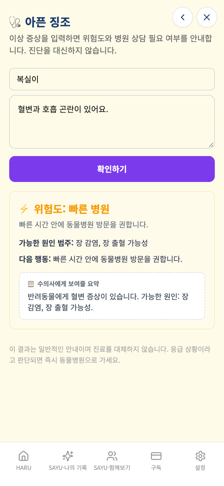

# 가상사용자 최종 4칸 — SNS·식물탐정·온비드·반려동물건강

- 실행 ID: `2026-10-09T06-16-31` · 대상: 가상인물 4명 · 방식: **A단계(격리 검증)** — 실제 앱 화면을 모바일 브라우저로 조작하고 Firebase·AI만 모의 (운영 DB·AI·서버 접속 0건)
- 점검 64개 중 60개 충족, 4개 미충족 · 발견 1건(치명 0 / 중대 1 / 경미 0 / 제안 0 / 참고 0) · 실행 시간 합계 43.9초

## 작성 경위

## 최종 배치의 기준과 판정 범위

- ① A단계 격리 검증 **22/22칸 완료**: 기존 18칸에 SNS 갈무리 p29·하루식물탐정 p30·온비드 부동산 p31·반려동물건강돌봄 p32를 추가했다. 이는 지정된 화면·입력·저장 시나리오 실행 완료이며, 발견된 제품 결함 수정 완료나 운영 정상 판정이 아니다.
- 앱 기준: 원격 GitHub main `4db3ce792da0a40678bd35afce8be74b696f1e9f`(시작 시 직접 fetch). 하네스 기준 `95f7c9897b3aa76cf3a6afd82462aadec0e0d7b1` + 이번 모의 응답·인물 파일. 실행 clone `/private/tmp/haru-persona-batch7`은 detached이며 커밋하지 않는다.
- 390×844 모바일 Chromium·Asia/Seoul·합성 인물 및 사진. 운영 .env·Firebase·실제 AI·외부 조회를 사용하지 않았다. 외부 링크는 window.open 의도만 가로채 기록했다.
- SNS 분석 callable은 원격 함수와 같은 성공/count 및 snsRecords 문서 모양을 로컬 SDK에 고정 생성했다. 업로드 ZIP은 유효한 빈 합성 ZIP이며, Facebook 실제 내보내기 파싱·중복제거·사진 썸네일·원본 ZIP 삭제는 검증하지 않았다. 이 성공은 ZIP 내용 분석 성공의 증거가 아니다.
- 식물 detectPlantAdvanced 응답은 서버 반환 구조를 따른 고정 값이며, PlantNet 모의·Plant.id disabled 형태다. 합성 사진 분석 실패/재시도·관찰/메모·사진 저장을 확인했으나 실제 식별 정확도·관리 조언·공유 도감·관리자 NIBR·실제 Storage 권한은 범위 밖이다. 숨김 LibraryPage를 복구하거나 점검하지 않았다.
- 온비드는 고정 모의 결과/0건/오류를 확인했다. 실제 공매 조회·가격 정확도·온비드 사이트 동작은 검증하지 않았다. 첫 보정에서 홈 온보딩 문서 쓰기를 온비드 기록 쓰기로 잘못 집계한 기대를 records 문서 범위로 수정했다. 제품 발견으로 채택하지 않았다.
- 반려동물 먹거리 응답은 unknown 고정 모의 값이며 실제 안전성 판정은 검증하지 않았다. 증상은 기존 앱의 로컬 규칙 결과를 비교했다. F-32는 단일 응급 입력에 다른 증상을 더했을 때 기존 위험 표시가 낮아지는 UI·저장 정합 문제이며 실제 의학 검증이 아니다.
- **기존 F-28 동일 원인 추가 재현 3건**: KST 2026-10-04 02:00에 증상·먹거리 checkedAt이 2026-10-03, 예방접종 vaccineDate 기본값이 2026-10-03. 각 페이지가 `new Date().toISOString().slice(0,10)`을 사용한다. 신규 번호를 부여하지 않았으며 미충족 점검에 그대로 남겼다. 접종 날짜를 직접 10월4일로 입력한 저장은 정상이다.
- 새 발견 F-32와 기존 날짜 재현은 증거만 기록했다. 앱 파일·Functions·Firestore 경로·리전·Rules·환경변수·결제·인증 구현 변경 없음. 앱 빌드 미실행(앱 수정 없음). 시나리오 node --check·격리 브라우저 실행·git diff --check 검증.
- 초기 실행의 폰트 403은 임시 clone에서 외부 node_modules 심볼릭 링크가 Vite allow 목록 밖에 있었기 때문이며 하네스 의존성 복사로 해결했다. 최초 잘못된 실행 경로 및 sandbox Chrome 실행 실패는 제품 발견으로 채택하지 않았다. 실행 보정 이력은 calibration-runs.json에 남겼다.
- 최종 원본 결과·합성 DB·집계는 verification.json, 선택 화면과 파일 해시는 evidence/ 및 sha256.json에 보관한다. 비용·토큰 실측은 미확인.
- ④ PR #270은 HEAD 1dacf47c, OPEN 초안·CI/프리뷰 SUCCESS, 독립 Claude 검토 대기 상태를 다시 확인했다. 기존 대표 화면 확인 충족. 병합·운영 배포 없음. ③ 미허용·C단계 금지. 다음 독립 작업은 ② 보조장부 수정 PR이며 별도 대화에서 정본 범위대로 시작한다.


## 먼저 볼 것

실제 사용자가 마주치면 결과가 틀리게 보이거나 신뢰를 해칠 수 있는 항목입니다(근거 화면·코드 위치는 2절).

- **F-32** [중대] 반려동물 복합 증상은 첫 일치 규칙만 적용해 응급 표시가 낮아진다

## 1. 인물별 요약

| 인물 | 형식 | 나이·성별·직업 | 단계(실패) | 점검 충족/전체 | 발견 | 소요 |
|---|---|---|---|---|---|---|
| 오유진 | SNS 갈무리 | 41세·여·쇼핑몰 자영업자 | 5(0) | 18/18 | 0 | 14.1초 |
| 박미란 | 하루식물탐정 | 57세·여·베란다 식물 30종 보호자 | 4(0) | 14/14 | 0 | 7.6초 |
| 김성훈 | 온비드 부동산 | 50세·남·직장인 | 4(0) | 13/13 | 0 | 6.6초 |
| 최지은 | 반려동물건강돌봄 | 36세·여·노령견 보호자 | 5(0) | 15/19 | 1 | 15.5초 |

## 2. 발견 사항 종합

| ID | 심각도 | 제목 | 형식·인물 |
|---|---|---|---|
| F-32 | 중대 | 반려동물 복합 증상은 첫 일치 규칙만 적용해 응급 표시가 낮아진다 | 반려동물건강돌봄 / 최지은 |

> 심각도: **치명**(데이터 손실·저장 실패) / **중대**(결과가 틀리게 보이거나 흐름이 막힘) / **경미**(불편·일관성) / **제안**(개선 아이디어·비용 확인) / **참고**(맥락 정보)

### F-32 [중대] 반려동물 복합 증상은 첫 일치 규칙만 적용해 응급 표시가 낮아진다

- 재현 인물: 최지은(반려동물건강돌봄) · 대표 단계: 단일·복합 증상 표시·저장 날짜
- 내용: 호흡 곤란 단독은 화면 응급·저장 emergency. 혈변과 호흡 곤란 복합은 화면 빠른 병원·저장 urgent. PetHealthSymptomPage findSymptomRule은 배열 find로 첫 혈변 규칙만 선택한다. 기존 위험 단계 표시의 정합을 비교했으며 실제 의료 판단 검증은 아니다.
- 증거 화면: 

## 3. 인물별 상세

### 오유진 — SNS 갈무리

| 항목 | 내용 |
|---|---|
| 나이·성별 | 41세 · 여 |
| 직업 | 쇼핑몰 자영업자 |
| 기기 | Chromium 모바일 390×844 |
| IT 숙련도 |  |
| 요금제 | 무료 |
| 사용 목적 | ZIP 선택·모의 수집·검색 저장·SNS 휴지통·복원·재접속을 확인한다. |

**시나리오**

1. 홈·비ZIP 거부
2. ZIP 모의 오류·재시도·타임라인
3. 검색·검색결과 저장
4. 휴지통·복원·재접속·격리

**실행 단계**

| # | 단계 | 결과 | 소요 | 화면에 뜬 안내 |
|---|---|---|---|---|
| 1 | 홈 → SNS·비ZIP 입력 거부 | 완료 | 7.8초 | ZIP 파일만 업로드할 수 있습니다. |
| 2 | ZIP 모의 실패·재시도·수집 완료 | 완료 | 1.0초 | 분석 완료: 3개 게시물이 정리되었어요. / 격리 ZIP 분석 실패 / ZIP 파일만 업로드할 수 있습니다. |
| 3 | 검색 적용·검색결과 저장·빈 상태 | 완료 | 2.2초 | 검색결과가 저장되었습니다 / 분석 완료: 3개 게시물이 정리되었어요. / 격리 ZIP 분석 실패 / ZIP 파일만 업로드할 수 있습니다. |
| 4 | SNS 휴지통 이동·복원·재접속 | 완료 | 2.6초 |  |
| 5 | 격리 확인 | 완료 | 0.0초 |  |

**점검 결과** — 충족 18 / 전체 18

미충족 점검 없음.

**호출·저장 요약**

- 모의 서버 함수 호출: analyzeFacebookZip 2회
- 저장된 기록 문서: 0건 · 사진 업로드 2건
- 외부 요청 차단 0건 · 모의되지 않은 함수 없음 · 콘솔 오류 1건 · 페이지 오류 0건

### 박미란 — 하루식물탐정

| 항목 | 내용 |
|---|---|
| 나이·성별 | 57세 · 여 |
| 직업 | 베란다 식물 30종 보호자 |
| 기기 | Chromium 모바일 390×844 |
| IT 숙련도 |  |
| 요금제 | 무료 |
| 사용 목적 | 합성 사진·분석 오류·모의 판독·관찰 저장·재접속을 확인한다. |

**시나리오**

1. 홈·빈 사진·사진 추가
2. 모의 분석 오류·재시도
3. 관찰과 판독 저장·재접속·격리

**실행 단계**

| # | 단계 | 결과 | 소요 | 화면에 뜬 안내 |
|---|---|---|---|---|
| 1 | 홈 → 식물탐정·빈 사진·추가 | 완료 | 4.7초 |  |
| 2 | 모의 식물 분석 실패·입력 유지·재시도 | 완료 | 1.1초 | 격리 식물 분석 실패 |
| 3 | 관찰·메모·촬영장소·오늘 기록 저장 | 완료 | 1.5초 |  |
| 4 | 격리 확인 | 완료 | 0.0초 |  |

**점검 결과** — 충족 14 / 전체 14

미충족 점검 없음.

**호출·저장 요약**

- 모의 서버 함수 호출: detectPlantAdvanced 2회
- 저장된 기록 문서: 1건 · 사진 업로드 2건
- 외부 요청 차단 0건 · 모의되지 않은 함수 없음 · 콘솔 오류 1건 · 페이지 오류 0건

### 김성훈 — 온비드 부동산

| 항목 | 내용 |
|---|---|
| 나이·성별 | 50세 · 남 |
| 직업 | 직장인 |
| 기기 | Chromium 모바일 390×844 |
| IT 숙련도 |  |
| 요금제 | 무료 |
| 사용 목적 | 조회 조건·페이지 이동·결과 없음·실패 안내·외부 링크 의도를 확인한다. |

**시나리오**

1. 홈·조회 조건·모의 결과
2. 다음 페이지·온비드 링크 의도
3. 빈 결과·오류·재시도·격리

**실행 단계**

| # | 단계 | 결과 | 소요 | 화면에 뜬 안내 |
|---|---|---|---|---|
| 1 | 홈 → 온비드·조건 조회 | 완료 | 3.4초 |  |
| 2 | 페이지 이동·외부 링크 의도 | 완료 | 1.2초 | 물건관리번호 MOCK-2 복사됨. 온비드에서 검색하세요. |
| 3 | 빈 결과·조회 오류·재시도 | 완료 | 1.6초 | 격리 온비드 조회 실패 / 검색 결과가 없습니다. 조건을 조정해 보세요. / 물건관리번호 MOCK-2 복사됨. 온비드에서 검색하세요. |
| 4 | 격리 확인 | 완료 | 0.0초 | 격리 온비드 조회 실패 / 검색 결과가 없습니다. 조건을 조정해 보세요. / 물건관리번호 MOCK-2 복사됨. 온비드에서 검색하세요. |

**점검 결과** — 충족 13 / 전체 13

미충족 점검 없음.

**호출·저장 요약**

- 모의 서버 함수 호출: getOnbidRealEstateList 5회
- 저장된 기록 문서: 0건 · 사진 업로드 0건
- 외부 요청 차단 0건 · 모의되지 않은 함수 없음 · 콘솔 오류 1건 · 페이지 오류 0건

### 최지은 — 반려동물건강돌봄

| 항목 | 내용 |
|---|---|
| 나이·성별 | 36세 · 여 |
| 직업 | 노령견 보호자 |
| 기기 | Chromium 모바일 390×844 |
| IT 숙련도 |  |
| 요금제 | 무료 |
| 사용 목적 | 증상·먹거리 모의 실패·접종 필수입력·저장·한국시간 새벽 날짜를 확인한다. |

**시나리오**

1. 홈·증상 빈 입력·미등록·복합 위험 표시
2. 먹거리 모의 실패·정상 응답·기록
3. 접종 필수값·날짜·메모 저장·재접속·격리

**실행 단계**

| # | 단계 | 결과 | 소요 | 화면에 뜬 안내 |
|---|---|---|---|---|
| 1 | 홈 → 증상·빈 입력·미등록 | 완료 | 4.2초 |  |
| 2 | 단일·복합 증상 표시·저장 날짜 | 완료 | 1.2초 |  |
| 3 | 먹거리 빈 입력·모의 실패·정상 기록 | 완료 | 4.1초 |  |
| 4 | 접종 필수값·원문·일정 저장 | 완료 | 5.7초 |  |
| 5 | 격리 확인 | 완료 | 0.0초 |  |

**점검 결과** — 충족 15 / 전체 19

| 미충족 점검 | 근거 |
|---|---|
| 증상 checkedAt은 한국시간 오늘이다 | 기존 F-28 UTC 날짜 방식 재현: 2026-10-03 |
| 복합 입력에서도 단일 응급 표시를 유지한다 | 위험도: 빠른 병원 |
| 먹거리 checkedAt은 한국시간 오늘이다 | 기존 F-28 UTC 날짜 방식 재현: 2026-10-03 |
| 접종일 기본값은 한국시간 오늘이다 | 기존 F-28 UTC 날짜 방식 재현: 2026-10-03 |

**호출·저장 요약**

- 모의 서버 함수 호출: petFoodCheck 2회
- 저장된 기록 문서: 0건 · 사진 업로드 0건
- 외부 요청 차단 0건 · 모의되지 않은 함수 없음 · 콘솔 오류 1건 · 페이지 오류 0건

## 4. 격리·안전 확인

- 운영 Firebase·AI·결제 서버로 나간 요청: **0건** (하네스 서버 밖으로 향한 요청은 모두 차단·집계했고 차단 기록 자체가 없음)
- 저장은 브라우저 메모리(+localStorage)에만 남고 인물마다 별도 저장소를 쓴다. 운영 데이터를 읽거나 쓰지 않는다.
- AI 응답(다듬기·제목 등)은 모의값이라 **AI 결과의 품질은 이 보고서에서 평가하지 않았다.**

## 5. 이 시뮬레이션으로 알 수 없는 것

- AI 가 만든 글의 품질(원문 보존, 사실 추가, 마크다운 혼입 등) — 운영 서버 대상 C단계가 필요하다.
- 실제 아이폰 Safari 고유 문제 — Chromium 모바일 에뮬레이션(390×844)이며 글꼴도 Noto Sans KR 로 대체되어 줄바꿈 위치가 실기기와 다를 수 있다.
- 사람의 취향·구독 의사 — 가상인물은 실제 사용자보다 협조적이다. 실제 사용자 테스트를 병행해야 한다.
- 소셜 로그인·결제·푸시 알림·외부 조회(법제처·온비드 등) — 이 하네스의 범위가 아니다.

## 6. 시간·비용

| 인물 | 실행 시간 |
|---|---|
| 오유진(SNS 갈무리) | 14.1초 |
| 박미란(하루식물탐정) | 7.6초 |
| 김성훈(온비드 부동산) | 6.6초 |
| 최지은(반려동물건강돌봄) | 15.5초 |
| 합계 | 43.9초 |

## 7. 다음 단계

1. 위 발견 사항 중 어떤 것을 수정할지 결정한다(이 보고서는 앱 코드를 바꾸지 않았다).
2. 형식·비서별 가상인물을 같은 방식으로 늘린다(2안 22명 중 나머지).
3. AI 결과 품질·외부 조회가 필요한 항목은 운영 서버 대상 C단계로 따로 진행한다(비용·운영 데이터 사용이라 대표 승인 필요).

## 8. 다시 실행하는 방법

```bash
cd frontend/test/persona-sim
npm install            # 최초 1회 (playwright-core, 글꼴)
node runner/run.mjs    # 모든 인물 실행 (예: node runner/run.mjs p01 p13)
node runner/report.mjs # 최근 실행 결과로 이 보고서 다시 만들기
```

> 실행 결과 원본(스크린샷·result.json)은 `out/runs/<실행ID>/` 에 남고 git 에는 올리지 않는다. 이 보고서에는 발견 증거 캡처만 `img/` 로 복사한다.
